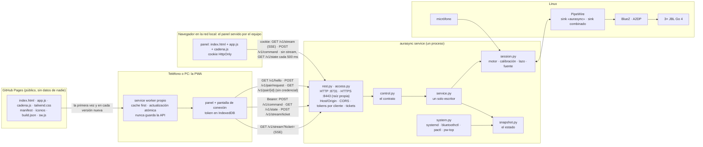

# 10 · El panel de control: qué tiene, cómo se organiza y por qué así

Diseño y medición del 2026-10-01. El panel es la interfaz del servicio de control
(d-7c8794-09d10f, spec del servicio §15). Este documento responde tres preguntas: **qué
tiene** el panel, **cómo se conecta** con el motor, y **qué organización** de sus partes cuesta
menos para las tareas reales, medido y no supuesto (d-7c8794-76b263).

## 1. Cómo se conecta

El mismo panel corre en dos lugares (d-7c8794-37f9bc, 2026-10-02): **servido por el equipo**
(`http://<equipo>:8731`, con la cookie, como siempre; es el respaldo) y como **PWA desde GitHub
Pages** (`https://fabaindaiz.github.io/bluetooth-sync/`), que habla con el equipo por la red local a
`https://<equipo>:8443` con el token de cada cliente. Las dos pasan por un solo transporte
(`host/web/src/transport.ts`); lo único que cambia es la credencial y cómo se abre el stream.



En texto, para la terminal:

```
GitHub Pages ──(archivos, una vez por versión)──► service worker ──► PWA (teléfono)
                                                                       │ HTTPS :8443, Bearer, stream por ticket
navegador en la red local ──(cookie, HTTP :8731)───────────────────────┤
                                                                       ▼
                                      rest.py + access.py ─► control.py ─► service.py
                                                                   │            │
                                                     snapshot.py ◄─┘            ▼
                                                        ▲                  session.py ─► PipeWire ─► BlueZ ─► Go 4
                                          system.py ────┘                       ▲
                                  (systemd, bluetoothctl, pactl, pw-top)        └── micrófono
```

**Primera conexión de un teléfono:** el QR de *Conectar teléfono* abre la PWA con
`#d=<equipo>:8443&fp=<huella de la raíz>` en el fragmento (que Pages nunca recibe); la PWA pregunta
`/v1/hello`, compara la huella, pide acceso y muestra un número de 4 dígitos; un administrador
(o la ventana del primer cliente, o un código de 6 dígitos) lo aprueba, y el token queda en el
teléfono. Si el teléfono no confía en la raíz, el `fetch` falla y la PWA explica cómo instalarla.
Probado en Chromium contra el servicio simulado (`tests_browser/test_pwa.py`); **sin probar en
teléfonos** (research/13 §5).

## 2. Qué tiene (el árbol)

Reorganizado el 2026-10-01 (noche) según lo que pidió el usuario: una pantalla principal con
lo de todos los días, Parlantes en el orden en que se usa, Diagnóstico en tres zonas, y cada
ajuste explicado.

```
Panel
├── Cabecera (fija)
│   ├── marca · SIMULADO · En vivo / Consultando · cambios sin guardar → Guardar · Conectar teléfono
│   ├── Barra de reproducción: Iniciar/Detener · Volumen · Fuente · chip de cortes (→ Cortes) · latencia
│   └── pestañas (en el teléfono, abajo)
├── Avisos (arriba) · «Deshacer» y el toast (abajo, 10 s; §7.1)
├── Escuchar (la principal)
│   ├── Ahora: estado · fuente · entrada · cortes · sincronía
│   │   ├── efectos con su explicación: Ambiente · Separar parlantes · Ecualización · Mantener sincronía
│   │   └── atajos: Calibrar y aplicar (un paso) · Identificar parlantes (un tono en cada uno)
│   ├── Presets: cargar · borrar · guardar el actual
│   ├── Parlantes (compacto): ambiente · volumen · silenciar · tono; con 4 o más, tarjetas plegadas y
│   │   acciones por grupo: Todos / Adelante / Atrás · Silenciar · Activar · Identificar (§7.4)
│   ├── Niveles (20 Hz, sincronizados con lo que suena)
│   ├── A/B ciego: sonoridad de A y de B y su diferencia (aviso sobre 0,5 LU) · «Igualar la sonoridad»
│   └── Entrada: espectro en vivo · correlación L/R · tipo · ancho de banda · formato
├── Cadena (2026-10-02, Preact: se dibuja entera desde la operación `chain`)
│   ├── Calidad: LUFS de entrada y de salida · ganancia de la cadena (LU) · PSR entrada/salida ·
│   │   pico real máximo · % del limitador · avisos «la cadena aplana» y «ganancia perdida» (texto y forma)
│   ├── Entrada → Ambiente → … → Limitador → Parlantes (cada etapa, un salto a su tarjeta)
│   └── una tarjeta por etapa, en el orden de proceso:
│       ├── qué hace (y (?) con el detalle) · latencia que agrega
│       ├── algoritmos: resumen · costo · latencia; los no disponibles, deshabilitados con el motivo
│       ├── perillas del algoritmo elegido (plegadas salvo que alguna esté cambiada): deslizador ·
│       │   número · unidad · ↺ al valor por defecto · (?) · «en vivo» / «con un corte breve» / «al reiniciar»
│       ├── por parlante: una columna por parlante en el PC, un bloque por parlante en el teléfono
│       └── en vivo: las métricas de la etapa (barras de reducción del limitador, etc.)
├── Parlantes (en el orden en que se usa: conectar, ajustar, ubicar)
│   ├── Dispositivos Bluetooth: Buscar cerca · agrupados en conectados, emparejados sin conectar y
│   │   encontrados · batería · señal · Conectar / Desconectar / Agregar / Olvidar
│   ├── Parlantes en detalle: tipo · rol · pan · ambiente · volumen · retardo · tono · silenciar · quitar
│   │   (en el teléfono, con 4 o más, una tarjeta plegada por parlante)
│   └── Sala: una distribución por cada una del servicio · plano con roles y los parlantes sin rol
├── Calibrar
│   ├── Calibración y ecualización: micrófono y su nivel (ventana objetivo) · segundos · amplitud ·
│   │   pasos 1-4 · resultados
│   └── Respuesta en frecuencia (20 Hz-20 kHz, medida y ecualización; tenue donde la coherencia es baja;
│       la leyenda esconde o muestra cada parlante)
├── Diagnóstico (tres zonas)
│   ├── izquierda: Salud (incluye el margen de la salida) y Cortes (línea de tiempo, tabla, causa probable;
│   │   un carril de radio por parlante con descartes/min y bitpool, y «Activar registro de radio»)
│   ├── derecha: Servicios
│   └── abajo, a todo el ancho: Logs
└── Ajustes (cada ajuste con una línea que explica qué hace y (?) con el detalle)
    ├── (Sonido se mudó a Cadena: un enlace lleva allá)
    ├── Sincronía: Recalibración continua · Medir cada · Escuchar durante
    └── Salida (avanzado): Salida · Bloque · Buffer de pw-play · Nombre de la salida · Emisor
```

17 tarjetas (la 17.ª, Cadena), una barra de reproducción y la cabecera. Cada tarjeta es independiente: la
organización solo decide en qué vista va, y una vista puede fijar zonas (Diagnóstico).

**La ayuda de cada ajuste** sigue la guía de "divulgación progresiva": una línea siempre
visible que dice qué hace, en palabras de quien escucha, y el detalle (cómo funciona, qué
cuesta, de dónde sale el valor por defecto) en un globo (?) al costado. El globo se abre
al pasar el mouse, al enfocarlo con el teclado o al tocarlo en el teléfono.

## 3. Las tareas con las que se mide

| Escenario | Frecuencia relativa | Controles, en orden |
|---|---|---|
| Escuchar música | 20 | iniciar · fuente · volumen · cargar un preset · volumen · detener |
| Ajustar el ambiente | 6 | ambiente de Blue · silenciar Red · ver cortes · activar Red · volumen |
| Calibrar y ecualizar | 2 | calibrar · aplicar · ecualizar · ver la respuesta · ver cortes |
| Comparar A/B | 1 | empezar · X · "es A" · X · "es B" · terminar |
| Resolver un problema | 1 | ver cortes (Salud) · servicios · filtrar logs · logs |
| Montar la sala | 0,5 | buscar parlantes · dispositivos · L C R S · pan de Blue · decorrelación (desde el 2026-10-02, en Cadena) |
| Afinar la cadena (desde el 2026-10-02) | 1 | calidad · saltar al limitador · pico real · abrir sus perillas · recuperación · ecualización apagada · ver cortes |

**Costo de un escenario = toques de navegación + pantallas de desplazamiento.** Se arranca en
la primera vista, arriba. Un control en otra vista cuesta 1 toque con pestañas o menú lateral; en
"inicio", 1 desde el inicio o hacia él y 2 entre dos pantallas de detalle. Un control fuera de la
zona visible (descontando las barras fijas) cuesta lo que hay que desplazarse para centrarlo,
en pantallas. **Las posiciones son las del render real** en Chromium, con el servicio simulado:
teléfono 390×844 y PC 1366×900 (`probes/10-panel-organizacion/medir.py`). Lo que el modelo no
cuenta: los toques propios de cada control (iguales en todas) y el esfuerzo de encontrar algo.
En Cadena, un salto a una etapa cuenta como un toque de navegación, y abrir las perillas plegadas
(`<summary>`) como un toque del control.

## 4. Las organizaciones

| | Navegación | Vistas |
|---|---|---|
| **pagina** | ninguna: todo apilado (la del 2026-10-01 a la mañana) | 1 |
| **pestanas** | pestañas arriba en el PC, abajo en el teléfono | Escuchar · Cadena · Parlantes · Calibrar · Diagnóstico · Ajustes |
| **inicio** | un inicio con lo diario y accesos a pantallas de detalle con "volver" | Inicio · Cadena · Sala y parlantes · Calibrar · A/B · Diagnóstico · Ajustes |
| **lateral** | menú lateral en el PC, abajo en el teléfono | Sonido · Cadena · Sala · Medir · Sistema |

## 5. Lo medido. MEDIDO (datos en `experimentos/datos/10/panel-organizaciones.json`)

Total ponderado (menos es mejor), en tres rondas: la primera con las tarjetas tal como venían,
y dos mejoras que salieron de mirar dónde estaba el costo.

| Ronda | Cambio | pagina | pestanas | inicio | lateral |
|---|---|---|---|---|---|
| 1, teléfono | — | 60,0 | 41,2 | 35,3 | 42,1 |
| 2, teléfono | presets antes que parlantes; barra de reproducción compacta (263 → 159 px) | 39,1 | 21,5 | 19,4 | 22,2 |
| **3, teléfono** | tarjeta de parlantes compacta | **34,7** | **18,4** | **17,0** | **19,1** |
| 1, PC | — | 14,3 | 6,6 | 8,2 | 7,2 |
| **3, PC** | (las mismas mejoras) | **13,2** | **6,5** | **8,1** | **7,1** |

Detalle de la ronda 3 (toques + pantallas):

| Escenario | Teléfono: pagina · pestanas · inicio · lateral | PC: pagina · pestanas · inicio · lateral |
|---|---|---|
| Escuchar música (×20) | 0 · 0 · 0 · 0 | 0 · 0 · 0 · 0 |
| Ajustar el ambiente (×6) | 1,1 · 1,2 · 1,1 · 1,2 | 0 · 0 · 0 · 0 |
| Calibrar y ecualizar (×2) | 6,7 · 1,0 · 1,0 · 1,0 | 3,1 · 1,0 · 1,0 · 1,0 |
| Comparar A/B (×1) | 1,6 · 1,8 · 1,0 · 1,8 | 0 · 0 · 1,0 · 0 |
| Resolver un problema (×1) | 7,4 · 4,0 · 3,9 · 3,9 | 3,7 · 2,4 · 2,4 · 2,5 |
| Montar la sala (×0,5) | 11,6 · 6,5 · 7,5 · 8,3 | 6,5 · 4,2 · 5,3 · 5,2 |

**Lo que dicen los números:**
- la **página única** (la de antes) es la peor siempre: el doble que las demás;
- las dos mejoras de la ronda 2 pesaron más que la organización misma: en el teléfono bajaron
  todas un ~45 %. Lo que más se hace (escuchar música) quedó en 0 en todas;
- **pestanas** es la mejor en el PC (6,5) y queda a un 8 % de **inicio** en el teléfono (18,4
  contra 17,0). La ventaja de "inicio" sale casi entera del A/B en pantalla propia; sin ese
  escenario quedan a 0,6.

### 5.1 Después de los arreglos de usabilidad (paquete D) y de la pantalla Cadena (paquete F). MEDIDO

Mac, Chromium headless, servicio simulado (2026-10-02). `pestanas`, total ponderado:

| Versión | Escenarios | Teléfono | PC |
|---|---|---|---|
| ronda 3 (2026-10-01) | seis | 18,4 | 6,5 |
| `f44efb2` (la tarjeta Ahora empujó la compacta y el A/B hacia abajo) | seis | 28,0 | 10,2 |
| paquete D (entre otros, `.inline` → `.hstack`) | seis | 24,6 | 9,9 |
| **paquete F (Cadena)** | seis | **26,1** | **10,0** |
| **paquete F (Cadena)** | siete (con «Afinar la cadena») | **31,4** | **13,7** |

De dónde salen los +1,5 del teléfono (medido escondiendo cada parte): +1,0 la decorrelación, que
pasó de Ajustes a la segunda tarjeta de Cadena («Montar la sala», ×0,5); +0,3 el recuadro de radio
en Cortes (empuja Servicios y Logs; sin registro ni datos ya no muestra los carriles); +0,2 la
casilla «Igualar la sonoridad» del A/B. La pestaña nueva no cuesta nada por sí misma (escondida, el
total no cambia).

**En Linux mide más (MEDIDO, 2026-10-04, `PC-Ryzen5`, Chromium headless):** el mismo código de `main`
(489fc8a) da **32,0** y **13,6** (seis: 26,7 y 10,0) contra 31,4 y 13,7 del Mac; la diferencia es del
render (las fuentes), no del panel, y la guardia fallaba por eso. Ahora la guardia lleva un límite
por plataforma. La etapa «Modo espacial» de Cadena (spec 2026-10-04) suma **+0,4** en los dos («Montar
la sala» pasa por encima de ella hasta la decorrelación); sus textos se acortaron a una línea para
dejarla en eso (era +0,5). Con el monitor de audífonos, al final de Escuchar, el total no cambia.

Las cuatro organizaciones con los siete escenarios (datos en
`experimentos/datos/10/panel-organizaciones-cadena-2026-10-02.json`):

| | pagina | pestanas | inicio | lateral |
|---|---|---|---|---|
| teléfono, siete (seis) | 94,2 (88,4) | 31,4 (26,1) | **27,5 (22,4)** | 30,3 (25,0) |
| PC, siete (seis) | 37,9 (34,9) | 13,7 (10,0) | 11,3 (7,9) | **10,8 (7,3)** |

**Lo nuevo que dicen:** en el PC, `pestanas` ya no es la mejor: su fila de pestañas suma 52 px a la
cabecera fija (153 px contra 101 de las otras) y eso cuesta desplazamiento en cada escenario. La
decisión de usarla por defecto (abajo) se tomó con la ronda 3; reabrirla es del usuario.

**Las perillas plegadas y los saltos.** Con todas las perillas abiertas, Cadena medía ~7 800 px en el
teléfono y «Afinar la cadena» costaba 16,9 (el limitador es la 8.ª etapa); plegándolas (abiertas
desde el principio si alguna está cambiada) bajó a 12,1, y con un salto a cada etapa desde la fila
«Entrada → … → Parlantes», a 5,3.

**Costo de dibujo** (`render_cost.py`, 390×844, DPR 3, datos en
`experimentos/datos/10/render-cost-2026-10-02.json`). El paquete D bajó Niveles, con freno ×4, de 421
a 17 layouts/s y de 326 a 97 ms/s de hilo principal. Con Cadena (paquete F): Niveles sigue en
16,6 layouts/s; su hilo principal midió 173-201 ms/s, **igual con y sin `cadena.js`** (201 contra
211, intercalados, con el Mac cargado: carga 13-17 contra 7-9 en la medición de D): la diferencia
con los 97 es la carga, no la pantalla nueva, que oculta no se dibuja (un test lo comprueba). La
propia Cadena a la vista, sonando (métricas a 5 Hz, calidad a 2 Hz): 3 layouts/s y 114 ms/s con
freno ×4 (2,2 y 33 sin freno), dentro del criterio (≤ 65 y ≤ 150).

**Decisión: pestanas por defecto** (d-7c8794-76b263). Es la mejor en el PC, casi empatada en el
teléfono, el mismo modelo en los dos, y nunca cuesta más de un toque cambiar de sección (en
"inicio", ir de un detalle a otro cuesta dos). Las otras tres siguen disponibles con
`?layout=pagina|inicio|lateral`, y la elección queda recordada en el navegador.

## 6. Cómo se construye

- **Tailwind v4.3.3, compilado y versionado.** `hatch run web:css` usa el CLI oficial (por
  `pytailwindcss`, sin Node) y escribe `panel/tailwind.css` (~40 KB). El servicio no depende de
  nada en tiempo de ejecución ni de internet: el teléfono abre el panel en la red local. **No** se
  usa el CDN de Tailwind: no funciona sin internet y su autor lo desaconseja para producción.
- Los componentes repetidos (`.card`, `.btn`, `.chip`, `.tile`, tablas, gráficos) están en
  `panel/tailwind.input.css` con `@apply`, porque `app.js` crea elementos con esas clases.
- **Modo oscuro** según el sistema.
- `window.aurasyncShow(selector)` muestra la vista que contiene un elemento: lo usan los tests y
  la medición.
- **La aplicación web en Vite + TypeScript + Preact** (d-7c8794-6da524, desde el 2026-10-02), solo
  para lo que se migra; hoy, la pantalla Cadena. Las fuentes están en `host/web/` (npm directo, con
  el Node del sistema; versiones exactas y `package-lock.json`):
  - `src/main.tsx` monta Cadena en `#chain-root`; `src/bridge.ts` recibe de `app.js` el estado y los
    eventos del stream (`aurasync:state`, `:quality`, `:chain`, `:radio`: `app.js` tiene el único
    `EventSource`) y manda las órdenes como él; `src/chain/*.tsx` son la pantalla; `src/format.ts` y
    `src/sender.ts`, la lógica pura (números en español, la franja de calidad, el ritmo de 80 ms).
  - `src/contract.gen.ts` **lo genera Python** (`hatch run gen-types`, desde
    `host/src/aurasync/contract_types.py`): las operaciones que manda la aplicación y sus
    argumentos salen de `control.OPS`, los conjuntos cerrados de los descriptores de `chain.py`, y
    las formas de las respuestas y los eventos, de `TypedDict`s que `tests/test_contract_types.py`
    contrasta con lo que el servicio simulado manda de verdad. Nada de una etapa en particular
    entra en ese archivo: una etapa nueva en Python aparece sin recompilar.
  - `npm run build` escribe `panel/cadena.js` (32 KB, 12 KB comprimido) y su sello
    `panel/cadena.build.json` (hash de las fuentes y de lo escrito); el build es determinista.
    `scripts/check.sh` lo comprueba **sin Node** con `host/scripts/web_stamp.py`.
    `npm run check` es `tsc` estricto; `npm test`, vitest con la lógica pura.
  - Las clases de Tailwind de `host/web/src` entran al mismo `tailwind.css` (`@source`).
- **Tests:** 81 de navegador en Chromium (2026-10-02, con `test_panel_usability.py`; antes 65) (Firefox no arranca en el Mac), entre ellos uno que recorre
  las 14 tarjetas en las cuatro organizaciones, uno del ir y volver de "inicio", y los de Cadena
  (`tests_browser/test_panel_chain.py`: se dibuja entera desde `chain`; algoritmo, perilla y ↺
  llegan al servicio; una etapa agregada en Python aparece sola; la franja de calidad y sus
  avisos; el A/B con la sonoridad; la radio en Cortes; el teléfono).

## 7. Los pendientes de usabilidad (2026-10-02)

Del informe de usabilidad (research/11 §4; recomendaciones 5, 10 y 11) y de experimentos/16 §7. Mac,
Chromium headless, servicio simulado. Cada cambio tiene su test de navegador
(`tests_browser/test_panel_usability.py`) y se lo vio fallar con una mutación del cambio.

### 7.1 Deshacer en vez de `confirm()`

"Never use a warning when you mean undo" (Raskin, VERIFICADO en research/11 §4.3). El panel ya no
abre ningún diálogo: `tests_browser/conftest.py` registra los diálogos de todos los contextos y cada
test falla si apareció uno. Hay dos clases de acción (`host/web/src/undo.ts`):

| Acción | Se hace | «Deshacer» (10 s) |
|---|---|---|
| Cargar un preset · quitar un parlante · aplicar una calibración (los dos botones) | al instante | vuelve a escribir el estado artístico de antes: los campos de cada parlante (`pan`, `ambience`, `gain_db`, `delay_ms`, `muted`, `kind`, `eq_db`), los globales (`rear_delay_ms`, `extract_ambience`, `decorrelate`, `eq_active`) y las elecciones de la cadena salvo el volumen; un parlante quitado se vuelve a agregar primero. Si el lazo corre, se apaga y se enciende alrededor de los retardos (como `calibration_apply`) |
| Olvidar un dispositivo · borrar un preset | se muestra hecho; la orden sale al vencer el aviso (o al irse de la página) | la cancela |
| Quitar la ecualización | al instante: las curvas se borran y la ecualización queda encendida y plana | vuelve a escribir las curvas (`eq_db`) |

**Lo que no vuelve (INFERIDO, por el contrato):** un parlante vuelto a agregar queda al final de la
lista. Un preset borrado no se puede volver a escribir desde el panel: por eso espera.

**Desde el 2026-10-04 `set` escribe `eq_db`** (una elevación por tercio, de 0 a 6 dB, o `null`;
`control.SPEAKER_FIELDS`): quitar la ecualización pasó a ser de la primera clase —se hace al instante y
«Deshacer» vuelve a escribir las curvas— y un parlante vuelto a agregar recupera su curva
(`test_clearing_the_eq_is_done_at_once_and_undo_writes_the_curves_back`, `web/test/undo.test.ts`).

### 7.2 El nivel del micrófono antes de calibrar

Como Dirac Live (research/11 §4.2): en el paso 1, una pista de −80 a 0 dBFS con la **ventana
objetivo marcada**, el número y el estado en palabras y con una forma: «en la ventana», «demasiado
bajo», «demasiado alto», «saturado», «sin música: no se puede comprobar», «sin lectura». Fuera de la
ventana, «Calibrar» (y «Calibrar y aplicar» en Escuchar) **avisa y pide confirmar** («Calibrar
igual» / «Cancelar») en vez de arrancar.

- **De dónde sale:** el mismo nivel que Niveles muestra como «Micrófono» (`meters.mic`, por el
  stream o en el estado). Lo mide el lazo: con el lazo apagado no hay lectura, y el panel lo dice.
- **La ventana es ORIENTATIVA (INFERIDO, sin medir con el fifine):** RMS de −55 a −10 dBFS y pico
  bajo −1 dBFS. «Demasiado bajo» solo se dice si algo suena (la entrada pasa de −45 dBFS): en
  silencio, el micrófono oye su piso (−60 dBFS en la sala simulada) y eso no es un error. La
  ventana se ajusta cuando haya calibraciones reales con su nivel anotado.
- **Lo que no mide:** el nivel de la música de ahora, no el del ruido de calibración (amplitud 0,1).
  Sirve para saber si el micrófono oye los parlantes y si satura, no para fijar la amplitud.

### 7.3 Coherencia en la respuesta en frecuencia

La calibración trae `results[].coherence` (γ² por tercio, alineada con `response_hz`; la agregó el
2026-10-02 otro paquete, `dsp/response.py`). Cada tercio se dibuja como un tramo propio, y uno con
**γ² < 0,5 va tenue** (clase `low-coherence`, opacidad 0,25), como el *blanking* de Smaart. El
umbral es **orientativo**: γ² = 0,5 es la mitad de la energía del micrófono explicada por lo que se
mandó. Sin el campo, la curva es una sola línea, como antes. Con 8 curvas no se lee ninguna
(experimentos/16 §7): cada parlante de la leyenda es un botón que esconde o muestra la suya.

### 7.4 Ocho parlantes. MEDIDO (render real, servicio SIMULADO)

Desde **4 parlantes** (con 3 todo se ve como antes):

- **Escuchar → Parlantes:** una tarjeta plegada por parlante (nombre corto y estado, Tono y
  Silenciar a la vista; ambiente y volumen al abrirla con ▸), y **acciones por grupo**: Todos /
  Adelante / Atrás · Silenciar · Activar · Identificar (un tono en cada uno, de a uno). Adelante y
  atrás salen del ángulo del rol (`role_places`, menos de 90° es adelante; los laterales van atrás),
  o de su lugar fijo, o sin rol del ambiente (0,35 o más es atrás): **INFERIDO** mientras el
  servicio no traiga la posición de cada parlante.
- **Parlantes en detalle**, en el teléfono: una tarjeta plegada por parlante en vez de la tabla de 9
  columnas. En el PC, la tabla.
- **Cadena**, en el teléfono: el bloque de cada parlante plegado; tocando el nombre se abre, y dice
  «cambiado» si alguna perilla propia de la cadena no está en su valor por defecto. En el PC, una
  columna por parlante (con 8, cada una ≥ 90 px).
- **Sala:** los botones de distribución salen de las del servicio (`roles`; con más de tres, en una
  grilla); cada rol va donde lo pone su ángulo (`role_places`, campo nuevo del estado en
  `snapshot.py`), y los parlantes sin rol se dibujan donde los ponen su pan y su ambiente (antes
  eran una línea de texto al pie).
- **Niveles** (11 barras) y **Cortes** (8 carriles de radio con el nombre) no cambiaron: entran.
- Dos colores más (`--s7`, `--s8`) para las curvas; el nombre va siempre al lado.

**Arreglos que salieron de medir con 8:** la ruta del archivo de cambios de la radio (una palabra
larga) ensanchaba la página del teléfono 63 px; y la fila de seis pestañas de abajo dejaba
«Ajustes» 18 px afuera (pasa con cualquier N).

Con `medir.py --ocho` (`pestanas`, datos en `experimentos/datos/10/panel-ocho-parlantes.json`):

| | teléfono 3 · 8 | PC 3 · 8 |
|---|---|---|
| total, siete escenarios | 31,4 · **41,5** | 13,7 · **15,9** |
| total, seis | 26,1 · 36,3 | 10,0 · 12,2 |
| alto de Escuchar (px) | 1934 · 2286 | 1076 · 1436 |
| alto de Parlantes (px) | 1913 · 2694 | 1289 · 1979 |
| alto de Cadena (px) | 4988 · 4998 | 2674 · 2664 |
| alto de Diagnóstico (px) | 3032 · 3072 | 1761 · 1781 |

Con 3 parlantes los totales no cambiaron (31,4 y 13,7, el tope del test de regresión). Con 8, lo que
más sube en el teléfono es el A/B y la entrada (debajo de 8 tarjetas y 11 medidores: 4,2 → 5,6) y
«Montar la sala» (5,8 → 8,3, 8 tarjetas de dispositivos). Parte del costo es el aviso «la
calibración se midió con la decorrelación encendida», que aparece porque con 7 u 8 la decorrelación
se apaga para que la sesión arranque (experimentos/16 §2). Nada se desborda en ninguna vista, en
390×844 ni en 1366×900 (test `test_eight_speakers_fit_every_screen`). **Sin probar en un teléfono
real.**


## 8. Pruebas de usabilidad por flujos (2026-10-04, `PC-Ryzen5`)

**Pedido (usuario):** "pruebas de usabilidad en la plataforma basadas en flujos y acciones que un
usuario haría, evalúes cómo resultan y posibles mejoras para aplicar. La idea es facilitar el uso de
la herramienta para el usuario final."

**Método (SIMULADO: Chromium headless, servicio simulado, 3 Go 4, sin parlantes).** Dos pasos, en
`probes/18-usabilidad/`: `capturas.py` saca cada pestaña entera en el teléfono (390×844) y en el PC
(1366×900), para mirarlas como alguien que llega por primera vez; `flujos.py` hace ocho tareas como
las haría una persona —con clics de verdad, en orden, desde Escuchar arriba y con la sesión
detenida— y cuenta toques, cambios de pestaña, pantallas de desplazamiento (lo que hubo que bajar
para ver el control antes de tocarlo) y lo que trabó. Complementa la medida de §5 (que compara
organizaciones con un modelo de costo): esta mira si la tarea **se puede hacer y se entiende**.

**Resultados en el teléfono (MEDIDO, antes → después de los arreglos de abajo):**

| Flujo | Toques | Pestañas | Pantallas | Lo que se encontró |
|---|---|---|---|---|
| Poner música | 3 → 3 | 0 → 0 | 0 → 0 | — |
| Probar el modo espacial | 2 → 2 | **1 → 0** | **2,07 → 0** | el modo no estaba en Escuchar: había que saber que vive en Parlantes → Espacial |
| Un parlante no suena | 3 → 3 | 0 → 0 | 0,90 → 0,90 | **los tres nombres se cortaban en «JBL Go 4…»**: no se sabía cuál era cuál |
| Calibrar | 2 → 2 | 0 → 0 | 0 → 0 | — |
| Guardar un preset | 3 → 3 | 0 → 0 | 0,41 → 0,42 | — |
| Audífonos | 3 → 3 | 0 → 0 | 2,46 → 2,51 | la tarjeta está al final de Escuchar (queda propuesto) |
| Sumar un parlante | 2 → 2 | 1 → 1 | 0 → 0,49 | **la tabla de dispositivos se cortaba: «Emparejar y conectar» quedaba fuera de la pantalla** |
| Ubicar los parlantes | 1 → 1 | 1 → 1 | 1,42 → 2,21 | con 3 parlantes la sala de fábrica (cuadrafonía) deja uno «sin rol», sin decir qué hacer |

En el PC los ocho flujos terminan, sin trabas, con a lo sumo 1,05 pantallas. Las pantallas que
subieron en «Sumar un parlante» y «Ubicar los parlantes» son el costo de lo que se arregló: la tabla
ahora es una tarjeta por dispositivo (más alta, pero con los botones a la vista) y el aviso de la
sala es texto nuevo.

**Lo que se aplicó (cada uno con su test en `tests_browser/test_panel_flows.py`):**

1. **El modo en la barra de reproducción** («Modo: clásico · espacial · frente intacto», junto a la
   fuente): a la vista en todas las pestañas, sin empujar ninguna tarjeta. Primero se probó en la
   tarjeta Ahora y la guardia de §5 lo atajó: empujaba Presets y «Escuchar música» (peso 20) pasaba a
   costar 0,54 pantallas, el total subía a 45,1.
2. **Los nombres enteros en el teléfono:** el nombre corto («Go 4 Red · FL») y el estado debajo, como
   ya se hacía desde 4 parlantes; el completo queda en el título.
3. **Dispositivos Bluetooth como tarjetas en el teléfono**, con los botones en su propia fila.
4. **La sala dice cuando un parlante quedó sin lugar** y ofrece «Usar «Automático»» en un toque.
5. **El A/B dice por qué no se puede empezar** («Hacen falta dos presets para comparar…»), en vez de
   un botón gris.
6. **«Medir desde aquí» enciende la sonda** si estaba apagada (y lo dice), en vez de mandar a Ajustes.

7. **El aviso del micrófono no se salta en un hueco de lectura:** al terminar una calibración el lazo
   vuelve a empezar y por unos segundos no hay lectura; en ese hueco «Calibrar y aplicar» calibraba sin
   avisar aunque el micrófono acabara de estar demasiado bajo. El último aviso vale 15 s. Lo encontró el
   test inestable de 2026-10-02, una vez instrumentado (`test_a_gap_in_the_reading_does_not_skip_the_warning`,
   visto fallar sin el arreglo).

La guardia de §5 sube +0,3 en el teléfono por los dos textos nuevos (4 y 5), anotado en el test.

**Propuestas que quedan (no aplicadas; cambian la organización o sacan información):**

- **Escuchar es larga en el teléfono** (2.900 px): «Entrada» (correlación L/R, ancho de banda, las
  aplicaciones) es diagnóstico y empuja al monitor de audífonos al final (2,5 pantallas). Pasarla a
  Diagnóstico, o plegarla, dejaría Escuchar en lo de todos los días.
- **«Parlantes en detalle» muestra la MAC, el códec y el `modalias`** en cada fila: para el usuario
  final es ruido, y empuja la sala más abajo (2,2 pantallas para ubicarlos). Llevarlo a un «ver
  detalles» por parlante.
- **La cabecera muestra «Latencia ≥ 399 ms»**, un número técnico que a quien escucha no le dice qué
  hacer; podría ir a Diagnóstico o al título de la sincronía.
- **El A/B pide dos presets guardados**: un «comparar con como está ahora» ahorraría el paso más
  largo del flujo.
- **Para una instalación de 3 parlantes la sala de fábrica debería ser «Automático»**, no
  cuadrafonía (hoy el aviso lo resuelve en un toque, pero el primer contacto ya tiene un error).

**Sin probar:** con personas (esto es una persona simulada, que sabe qué buscar) y en un teléfono real.


## 9. Auditoría (1/2): las apps del rubro, los estándares de UI y cómo evaluar (2026-10-07)

Pedido del usuario (2026-10-07): revisar el panel y adaptarlo "según los estándares del software
existente", **con el PC primero**. Es la investigación de escritorio, hecha en una sesión lateral el
2026-10-07: cada afirmación lleva su marca y su fuente, al final de esta sección. La parte medida está en
[experimentos/22](experimentos/22-auditoria-medida-del-panel.md), y la lista que junta las dos, en §10.

**Fecha:** 2026-10-07 (todas las fuentes se leyeron ese día, salvo que se diga otra cosa).
**Pedido (usuario):** revisar el panel y adaptarlo a los estándares del software existente. **Prioridad: el PC primero, el teléfono después.**
**Alcance:** lo que ya está en `docs/research/10-panel-de-control.md` (qué tiene el panel, las cuatro organizaciones medidas, deshacer, el nivel del micrófono, ocho parlantes, los flujos), en `11-…` §4 (EBU 3341, Smaart, Trueplay, el nivel del micrófono de Dirac, divulgación progresiva, Raskin, WCAG 1.4.1/1.4.11/2.2.2/2.5.8, rendimiento, SUS como serie temporal) y en `14-…` (consolas espaciales, CamillaDSP como motor, Pulsemeeter como modelo de matriz) **no se repite**: aquí va solo lo nuevo.

**Marcas.** **VERIFICADO**: leído en la fuente primaria (documentación o manual del fabricante, la norma, el comunicado oficial). **REPORTADO**: fuente secundaria (prensa, foro, tutorial de terceros, reseña). **INFERIDO**: conclusión propia a partir de lo anterior o de leer el código del panel. **SUPOSICIÓN**: viene de memoria y no se pudo comprobar. Cada afirmación lleva su fuente entre corchetes; las URL están al final (§6).

**Cómo se hizo.** Lectura directa de las páginas (texto, sin descargar código ni imágenes al repositorio), PDF del manual de la X AIR leído en un directorio temporal, y una lectura breve del código del panel (`host/src/aurasync/panel/`, `host/web/src/`) solo para ubicar dónde pega cada norma. Nada de esto entra al repositorio.

---

### Resumen: lo que cambia decisiones

1. **Sonos volvió a las pestañas.** El rediseño de 2024 eliminó "saltar de pestaña en pestaña" con una pantalla de inicio única y un panel de sistema que se desliza desde abajo [SON1, VERIFICADO]; tras el fracaso, la app de **Sonos 27 (2026-09-08)** se organiza en **Inicio, Sistema y Búsqueda abajo**, con salas fijadas arriba, "moldeada y probada con la comunidad", y anuncia **presets** (parlantes + contenido + volumen) y **vistas de salud del sistema** [SON5, VERIFICADO]. Refuerza la decisión de pestañas del panel y la idea de una vista de sistema siempre a mano.
2. **La lección de proceso de Sonos vale más que la de diseño:** su revisión interna comprometió **cambios graduales con opción de volver**, un modo de **funciones experimentales opcionales** y pruebas beta con más tipos de usuarios y configuraciones [SON3, VERIFICADO]. El panel ya tiene `?layout=`; falta tratarlo como "acceso anticipado" y no como opción escondida (INFERIDO).
3. **Lo que todas las herramientas serias comparten para comparar:** un **interruptor de desvío por bloque y global** (Roon: "great for A-B testing" [ROO1]; Peace: encender y apagar "para comprobar lo que se ecualizó" [PEA1]), **curvas antes/después superpuestas** (Dirac: *Measured*/*Corrected* [DIR2]; X AIR: RTA antes o después del EQ [XAI1]). Todo VERIFICADO. El panel tiene el A/B ciego (más riguroso) pero no un desvío rápido no ciego.
4. **Estado de la cadena en un solo indicador:** Roon pone una luz de color en el pie de la pantalla que resume la ruta de la señal (sin cambios, procesada a pedido, alta calidad, con pérdida) y **se pone roja un instante si una sola muestra satura** [ROO2, ROO3, VERIFICADO]. Es el patrón más barato para "¿está todo bien?" en el PC.
5. **Presets de consola: alcance, "safes" y deshacer la carga.** Yamaha y Behringer guardan todo pero al cargar respetan **parámetros y canales protegidos** ("recall safe", "channel safes"), y Yamaha tiene **"Recall Undo"** y **"Update Undo"** [YAM1, YAM2, XAI1, VERIFICADO]. Dirac guarda **snapshots con la hora como nombre**, renombrables [DIR3, VERIFICADO].
6. **Accesibilidad, lo nuevo de WCAG 2.2 que pega aquí:** 1.4.13 (los globos (?) deben poder cerrarse sin mover el foco: hoy se abren por CSS con `:hover`/`:focus-within` y no hay `Escape`, INFERIDO del código), 2.4.11 (el foco no puede quedar tapado por la cabecera fija), 2.5.7 (todo arrastre con alternativa sin arrastrar), 2.5.8 (24 px) [W22, VERIFICADO].
7. **axe-core no revisa el tamaño de blancos salvo que se le pida:** la regla `target-size` (WCAG 2.5.8) está **desactivada por defecto** en axe-core 4.14 [AXE1, VERIFICADO]; Lighthouse da una nota que es un promedio ponderado de reglas de axe, todo o nada por regla [LH1, VERIFICADO]; las pruebas automáticas encuentran ~57 % de los problemas según el estudio del fabricante de axe [DEQ1, REPORTADO].
8. **SUS tiene versión validada en español** (México, n = 88, α = 0,812, CC BY 4.0) [SUS3, VERIFICADO]; el promedio de referencia de SUS es 68 [SUS2, REPORTADO].

---

### 1. Aplicaciones del mismo tipo

#### 1.1 Tabla comparativa

Leyenda: N = navegación; F = cómo muestra el flujo o el ruteo; S = estado por canal o salida; M = medidores; P = presets, snapshots y deshacer; AB = antes/después; SA = simple/avanzado; 1.ª = primer uso.

| App | N | F | S | M | P | AB | SA | 1.ª |
|---|---|---|---|---|---|---|---|---|
| **Sonos 2024** | Inicio único personalizable; el control del sistema sube desde abajo; "tab to tab jumping a thing of the past" [SON1, VERIFICADO]. Web app reemplaza al controlador de escritorio [SON1, VERIFICADO] | — | "visual overview of what's playing on each of your products", agrupar, volumen desde cualquier parte [SON1, VERIFICADO] | — | — | — | — | — |
| **Sonos 27 (2026)** | **Inicio · Sistema · Búsqueda abajo**, gestos, salas fijadas arriba [SON5, VERIFICADO] | — | perilla de volumen virtual con dos dedos [SON5] | — | **Presets** = parlantes + contenido + volumen, un toque (anunciados para "later this fall") [SON5] | — | — | "shaped and tested with the Sonos community"; funciones en *Early Access* [SON5] |
| **Dirac Live** | Pestañas en orden de calibración con **botones anterior/siguiente** y salto directo; barra lateral con el equipo y los filtros cargados [DIR1, VERIFICADO] | Grupos de canales que se arrastran entre grupos; cada grupo con su curva objetivo [DIR2] | Clic en un canal o en el grupo elige qué curvas ver; Ctrl+clic para varios [DIR2] | Barra de nivel de prueba con ventana objetivo (en 11 §4.2) | **Snapshots** con la hora como nombre, renombrables; guardar/cargar curvas objetivo; "Set default target curve" [DIR3]. Filtros en 8 *slots* ligados a presets [DIR4] | Casillas **Measured** / **Corrected**, *Spread* (todas las posiciones), cortinas de rango [DIR2]; escuchar cada filtro con casillas en la barra lateral [DIR4] | Curva con dos estantes (graves 0 a +12 dB, agudos −3 a +4 dB) **o** puntos de control; se convierte una en otra [DIR3] | **Superposición de ayuda la primera vez que se abre cada pestaña**, se reabre con (?) [DIR1] |
| **JBL Portable / JBL One** | — (no documentado) | Modos **Stereo** / **Party** [JBL1, VERIFICADO] | "connection status, battery level, playback content all at a glance" (One) [JBL2, VERIFICADO] | — | — | — | EQ personalizable [JBL1, JBL2] | "step-by-step guidance" (One) [JBL2] |
| **CamillaGUI** | Pestañas = secciones del archivo de configuración: Title, Devices, Filters, Mixers, Processors, Pipeline, Files [CAM1, REPORTADO] | **Pipeline**: gráfico de toda la cadena y **mapa** de cómo se aplican mezcladores y filtros; magnitud/fase/retardo de grupo por canal [CAM1] | Etiquetas de canal en mezcladores, pipeline y medidores [CAM1] | Medidores de nivel; intervalo de actualización configurable, 100 ms por defecto [CAM2, VERIFICADO] | Archivos de configuración; uno por defecto (estrella) [CAM1] | — | **Vista compacta** para teléfono: volumen, configuración y atajos (graves/agudos) [CAM1, CAM2] | — |
| **Pulsemeeter** | (estilo Voicemeeter) [PUL1, VERIFICADO] | Grafo de ruteo: entradas y salidas físicas y virtuales ("grupos"), mapa puerto a puerto [PUL2, VERIFICADO] | Volumen y silencio por dispositivo [PUL1] | — | — | — | — | — |
| **Elgato Wave Link 3** | Vista de mezclas; ajustes abajo a la izquierda [WL1, VERIFICADO] | **Matriz**: entradas a la izquierda, mezclas arriba (hasta 5); cada mezcla sale por N dispositivos [WL1] | Volumen por mezcla y por canal; la vista de mezclas se puede **encoger** [WL1] | Medidor de ganancia con **zona objetivo (~−12 dB)** [WL1] | — | **Sound Check**: grabar la voz y escuchar los efectos antes de salir al aire [WL1] | Efectos VST3/AU por entrada [WL1] | **Tour de configuración** al conectar un equipo, re-ejecutable desde ajustes ("Start Setup Tour") [WL1] |
| **Equalizer APO + Peace** | Peace: lista de configuraciones a la izquierda, destinos a la derecha [PEA1, VERIFICADO] | APO: editor gráfico con panel de análisis de la respuesta calculada por equipo y canal [APO1, REPORTADO] | Destino "all" o un parlante (hasta 9) [PEA1; PEA2, REPORTADO] | — | Clic en una configuración = cambio inmediato; **atajo de teclado por configuración**; menú de bandeja [PEA1] | **Interruptor on/off** "so you can check what you have equalized" [PEA1] | Panel de efectos aparte (crossfeed, upmix, downmix) [PEA1] | Botones de ayuda con manual [PEA1] |
| **Roon (MUSE)** | Pantalla del DSP por zona [ROO1, VERIFICADO] | **Lista de filtros en el orden de proceso**; tres fijos (Headroom, Sample Rate Conversion, Speaker Setup), el resto se agregan y reordenan [ROO1] | **Signal Path**: luz en el pie (morada sin cambios, azul procesada a pedido, verde alta calidad, amarilla con pérdida); clic = la cadena paso a paso [ROO2] | **Indicador de saturación**: la luz se pone **roja un instante**, "even a single clipped sample" [ROO3] | — | **Interruptores global y por sección: "great for A-B testing"** [ROO1] | — | — |
| **Behringer X AIR Edit** | **Pestañas de navegación** + tira del canal siempre visible ("always visible regardless of which tab is selected") [XAI1, VERIFICADO] | Pestañas por bloque: Input, Gate, EQ, Comp, Sends, Main, FX [XAI1] | Tira con estado de phantom, envíos, pan; clic en Gate/EQ/Comp salta a su página [XAI1] | Página de medidores; **RTA antes o después del EQ**, espectrograma; **frecuencia de actualización 100 % o 50 %** [XAI1] | Shows → snapshots; **alcance de la carga** por canal y parámetro; **"Channel safes"** [XAI1] | RTA pre/post EQ [XAI1] | **Botón S/E: vista simple o expandida** de cada página; **modo Fine** de faders [XAI1] | — |
| **Yamaha DM3/DM7** | — | — | Escena actual resaltada en verde; nombre arriba a la izquierda [YAM1, YAM3, VERIFICADO] | — | **Recall Undo**, **Update Undo**, **Delete/Duplicate Undo** (solo inmediatamente después); protección contra escritura; orden por hora; **Recall Safe** por canal y parámetro [YAM1, YAM2] | — | — | — |
| **SoundScape Renderer** | Una ventana: escena en 2D, transporte, línea de tiempo arriba [SSR1, VERIFICADO] | **Mapa espacial**: fuentes con medidor y volumen debajo, íconos de los parlantes [SSR1] | Fuente silenciada con marco gris; fija con una cruz [SSR1] | Medidor maestro −50 a +12 dB con línea en 0 dB; **carga de CPU** [SSR1] | Pestañas de escenas desde un archivo [SSR1] | — | Diálogo de propiedades (clic derecho) para posiciones exactas [SSR1] | — |

#### 1.2 Ficha por aplicación: lo propio, lo que vale tomar y lo que se criticó

**Sonos (2024 → 2025 → Sonos 27).**
- **Cronología (VERIFICADO salvo marca):** 2024-04-23 anuncio: inicio único personalizable, búsqueda siempre visible, control del sistema deslizando hacia arriba, y una **web app que reemplaza al controlador de escritorio** [SON1]. 2024-05-07 sale todo a la vez [SON1]. Julio de 2024: carta de disculpa del CEO [SON6, REPORTADO]. 2024-10-01: siete compromisos tras una revisión interna; **"more than 80% of the app's missing features have been reintroduced"**; cambios mayores **graduales**, **funciones experimentales opcionales**, beta "con más tipos de clientes y configuraciones más diversas por más tiempo" [SON3]. 2024-10-28, 2024-12-10, 2025-03-14: la página de soporte lista lo restaurado (edición de listas, posponer alarmas, batería de los portátiles, desempeño de búsqueda y de los deslizadores de volumen, mensajes de error de conexión) [SON2]. 2026-09-08: **Sonos 27app**, Inicio/Sistema/Búsqueda abajo, presets y vistas de salud anunciados [SON5].
- **Lo criticado (REPORTADO):** funciones quitadas (temporizador, edición de cola y listas, biblioteca local), **más pasos para lo mismo**, quitar los números de volumen y el EQ [SON6]; **regresiones de accesibilidad**: VoiceOver sin encabezados, reordenar solo arrastrando [SON7]; el escritorio pasó a una web app peor para bibliotecas locales y con controles que dejaron de funcionar [SON8].
- **Para el panel (INFERIDO):** (1) nunca quitar una función al reorganizar —el panel ya mide el costo de cada cambio (10 §5)—; (2) una **vista de sistema** siempre a mano con el estado de cada parlante; (3) los cambios de organización como **opción probada antes de ser la de fábrica**; (4) la accesibilidad con teclado y lector de pantalla se cuida en cada cambio, no después; (5) **presets = parlantes + fuente + volumen** es la definición de consumo de "preset" (el del panel es más rico: estado artístico de la cadena).

**Dirac Live (escritorio).** Lo propio: un **asistente que sigue siendo navegable** (pestañas en el orden de calibración, con anterior/siguiente y salto directo) [DIR1]; la **ayuda sale sola la primera vez de cada pestaña** y vuelve con (?) [DIR1]; notificaciones arriba a la derecha, verdes las normales y negras/naranjas las advertencias [DIR1]; en el diseño, casillas para superponer la respuesta medida y la corregida, la dispersión entre posiciones y el rango de corrección [DIR2]; **dos niveles de control de la curva** (dos estantes simples o puntos de control) [DIR3]; **snapshots** de grupos + curvas + rangos, con la hora como nombre [DIR3]; escuchar filtros distintos marcando casillas en la barra lateral [DIR4]. Todo VERIFICADO en el manual de miniDSP para el Tide16 (que documenta la interfaz de Dirac Live). Vale tomar: el asistente navegable para **Calibrar**, la ayuda por pestaña la primera vez, y los snapshots automáticos con hora (INFERIDO).

**JBL Portable / JBL One.** Lo documentado es poco: modos Stereo/Party, EQ, actualizaciones (Portable) [JBL1]; configuración paso a paso, estado de conexión, batería y contenido "de un vistazo", pares estéreo y sistemas multicanal (One) [JBL2]. Todo VERIFICADO en la ficha de la App Store. Una reseña de la ficha de JBL One se queja de que el volumen "parece tener unos 8 pasos" y de tener que "bajar varios niveles" para llegar a la música [JBL2, REPORTADO, una sola reseña]. Para el panel: es la app que el usuario conoce de sus parlantes; el vocabulario "Stereo / Party" es el que trae (INFERIDO).

**CamillaGUI.** Lo propio: las pestañas **reflejan la estructura del archivo de configuración** (pensada para quien conoce el motor), **separa lo editado de lo aplicado** ("Apply to DSP", "Save to File", "Apply and save", casillas "Apply automatically"/"Save automatically", "Fetch from DSP") y tiene una **vista compacta** para el teléfono con volumen, configuración y atajos [CAM1, REPORTADO, tutorial de terceros]; los atajos se definen en `gui-config.yml` (deslizador numérico con rango y paso, o casilla) y aplicar automáticamente viene **apagado** por defecto [CAM2, VERIFICADO]. Para el panel: la vista compacta es el modelo para el **teléfono como control remoto** (fase 2); la separación editado/aplicado ya existe ("cambios sin guardar → Guardar") (INFERIDO).

**Pulsemeeter.** "A frontend to ease the use of pulseaudio's routing capabilities, much like voicemeeter's workflow": dispositivos virtuales, ruteo entre físicos y virtuales, volumen y silencio, mapa de puertos [PUL1, PUL2, VERIFICADO]. La disposición en tiras verticales con botones de destino es **SUPOSICIÓN** (no se pudo ver la captura sin descargarla). Ya está en 14 §1 como modelo de la matriz de ruteo.

**Elgato Wave Link 3.0.** Lo propio: **matriz entradas × mezclas** como vista principal, que se puede encoger; el medidor de ganancia con **zona objetivo** y **Auto Gain** en los equipos nuevos; **Sound Check** (grabar y escuchar con efectos); **tour de configuración re-ejecutable**; tema Sistema/Oscuro/Claro; canal de versiones Estable/Beta [WL1, VERIFICADO]. Vale tomar: el tour re-ejecutable para **conectar parlantes + identificar + calibrar**, y "escuchar antes de aplicar" como versión no ciega del A/B (INFERIDO).

**Equalizer APO + Peace.** APO: editor gráfico (desde 1.0) con un panel de análisis de la respuesta calculada para el equipo y canal elegidos [APO1, REPORTADO por un resumen del registro de cambios]; versión 1.4.2 del 2025-11-28 [APO2, VERIFICADO]. Que el panel de análisis muestre ganancia pico, latencia y CPU es **SUPOSICIÓN** (no se pudo abrir la wiki). Peace: elegir destino "all" o un parlante, **cambio inmediato al hacer clic en una configuración**, **un atajo de teclado por configuración**, menú de bandeja, **interruptor para comparar** [PEA1, VERIFICADO]. Vale tomar: **atajos de teclado a presets** en el PC (cuidando WCAG 2.1.4, §2.1).

**Roon (MUSE, antes "DSP Engine").** Lo propio: un DSP **por zona** (≈ por salida); lista de filtros **en el orden de proceso**, con los fijos marcados; **interruptores global y por bloque para A/B**; la **luz de la ruta de la señal** con cuatro calidades; la **saturación pone la luz roja** un instante [ROO1–ROO3, VERIFICADO]. Es lo más cercano a la pantalla Cadena del panel. Vale tomar: el desvío por etapa, y la luz en la cabecera que resume calidad y saturación, con forma y texto además del color (WCAG 1.4.1) (INFERIDO).

**Mezcladores digitales (Behringer X AIR, Yamaha DM).** X AIR Edit: pestañas + **tira del canal siempre visible**; clic en una sección de la tira salta a su página; **S/E** (simple/expandida) en cada página; **Fine** para mover los faders más despacio; RTA pre/post EQ; frecuencia de actualización de medidores y RTA al 100 % o 50 % "to conserve processing power"; snapshots con alcance y **Channel safes**; "Safe Levels" silencia las salidas al encender [XAI1, VERIFICADO, manual XR18/X18/XR16/XR12]. Yamaha DM7/DM3: deshacer la carga, la actualización y el borrado **solo inmediatamente después**; protección contra escritura; orden por hora; escena actual resaltada; **Recall Safe** por canal y parámetro [YAM1–YAM3, VERIFICADO]. Vale tomar: S/E por tarjeta, modo fino, safes por parlante y "Deshacer la carga" (el panel ya lo tiene con 10 s) (INFERIDO).

**SoundScape Renderer.** GUI de escritorio: la escena como mapa 2D con medidor y volumen bajo cada fuente, íconos de parlantes, medidor maestro −50 a +12 dB con línea en 0 dB, carga de CPU, y **atajos de teclado completos** (+/− 1 dB, espacio, `m` silencio, `s` solo, 1-9 elegir) [SSR1, VERIFICADO]. Advierte que **la GUI cuesta CPU** y que "one day we will also implement a variable frequency for the screen update" [SSR1]. La GUI web es "a highly experimental prototype" sobre el WebSocket [SSR2, VERIFICADO]. Vale tomar: el teclado de SSR como referencia de atajos de una consola espacial, y el aviso de costo (el panel ya mide el suyo, 10 §5.1).

#### 1.3 Patrones que se repiten (INFERIDO de §1.1)

| Patrón | Dónde | Estado en el panel (INFERIDO del código y de 10) |
|---|---|---|
| Estado del sistema siempre visible | Sonos (Sistema), X AIR (tira), Roon (luz del pie), SSR (medidor maestro), Dirac (barra lateral) | Cabecera fija con barra de reproducción, chip de cortes y latencia; no hay un resumen por parlante a la vista en todas las pestañas |
| Cadena como lista en orden de proceso | Roon, CamillaGUI (pipeline), APO | Fila «Entrada → … → Parlantes» de Cadena: ya está |
| Ruteo como matriz | Wave Link, CamillaGUI (mixers), Pulsemeeter | No hay (propuesto en 14 §1) |
| Ruteo como mapa espacial | SSR, Dirac (grupos) | Sala (plano con roles) |
| Comparar con un desvío | Roon, Peace, Dirac, X AIR | A/B ciego entre presets; no hay desvío rápido por etapa |
| Presets con alcance, safes y deshacer | Yamaha, X AIR, Dirac | Deshacer 10 s, el volumen fuera del preset; sin safes por parlante |
| Simple / avanzado en el mismo lugar | X AIR (S/E), Dirac (estantes/puntos), CamillaGUI (compacta) | Perillas plegadas y divulgación progresiva; sin un interruptor explícito |
| Primer uso como tour re-ejecutable o ayuda por pantalla | Wave Link, Dirac, JBL One | Ayuda (?) por ajuste; sin recorrido de primer uso |
| Frecuencia de medidores configurable | X AIR, CamillaGUI, SSR (deseado) | Fija (medidores ~18 Hz, 11 §4.4) |

---

### 2. Normas para un panel de control "PC primero"

#### 2.1 WCAG 2.2 AA: los criterios que más pesan en un panel de audio en tiempo real

WCAG 2.2 es Recomendación del W3C del 2024-12-12 [W22, VERIFICADO]. Los textos citados son los de la norma. La columna "Panel" es INFERIDO de leer el código (no es una auditoría con herramientas).

| Criterio | Nivel | Qué exige (resumen fiel) | Dónde pega en el panel |
|---|---|---|---|
| 1.3.1 Info y relaciones | A | Estructura y relaciones determinables por programa | Encabezados por tarjeta: Sonos perdió los encabezados en 2024 y los usuarios de VoiceOver lo sintieron [SON7, REPORTADO] |
| 1.4.1 Uso del color | A | El color no puede ser el único medio | Ya marcado en 11 §4.3; vale para la luz de estado propuesta (§4) |
| 1.4.3 Contraste | AA | 4,5:1 texto normal | En claro y oscuro |
| 1.4.10 Reflow | AA | Sin desplazamiento en dos dimensiones a 320 px de ancho (= 1280 px al 400 %) | **Pega en el PC**: 1280 px con zoom 400 % debe verse como el teléfono; la tabla de 9 columnas de Parlantes en el PC necesita su versión apilada también por zoom (INFERIDO) |
| 1.4.11 Contraste no textual | AA | 3:1 para componentes y partes de gráficos | Ya en 11 §4.3 |
| **1.4.13 Contenido al pasar o enfocar** | AA | Lo que aparece al pasar el puntero o enfocar debe poder **cerrarse sin mover el puntero ni el foco**, poder recorrerse con el puntero y **persistir** | **Los globos (?)**: `.help:hover .help-pop, .help:focus-within .help-pop` en `tailwind.input.css`, y `app.js` no maneja `Escape` → probable falla de "Dismissible" (INFERIDO) |
| 2.1.1 Teclado | A | Todo operable con teclado | Deslizadores nativos (bien); el plano de Sala y la leyenda de curvas, a revisar |
| **2.1.4 Atajos de una tecla** | A | Atajos de un solo carácter: poder apagarlos, reasignarlos o que solo actúen con foco | Si se agregan atajos tipo Peace/SSR (espacio, `m`, 1-9), usar modificadores o permitir apagarlos |
| **2.2.2 Pausar, detener, ocultar** | A | Lo que se actualiza solo y en paralelo: pausar, detener, ocultar **o controlar la frecuencia** | Medidores, espectro, cortes. Ya en 11 §4.3; la salida que usan X AIR y CamillaGUI es **elegir la frecuencia** [XAI1, CAM2] |
| **2.3.1 Tres destellos** | A | Nada destella más de 3 veces por segundo (o bajo el umbral) | El indicador de saturación y el de cortes: retener el rojo (como Roon, "momentarily") en vez de parpadear a la tasa del stream (INFERIDO) |
| 2.4.3 / 2.4.7 Orden y foco visible | A / AA | — | Hay 7 reglas de foco en `tailwind.input.css` (conteo) |
| **2.4.11 Foco no tapado (mínimo)** | AA | Un componente con foco no puede quedar **enteramente** oculto por contenido del autor | Cabecera fija (101-153 px) y barra inferior en el teléfono; `scroll-padding-top: 12rem/11rem` ya existe en `tailwind.input.css` (bien encaminado; verificar con Tab en cada vista) |
| 2.5.1 Gestos de puntero | A | Gestos multipunto o de trayectoria con alternativa de un punto | La "perilla de dos dedos" de Sonos 27 [SON5] no se copia sin alternativa |
| 2.5.2 Cancelación del puntero | A | Ejecutar en el evento de subida, o poder abortar/deshacer | `pointerdown` en `app.js:304` solo marca "editando" (INFERIDO); revisar que nada se ejecute ahí |
| 2.5.3 Etiqueta en el nombre | A | El nombre accesible contiene el texto visible | El volumen está envuelto en una `<label>` que incluye el `<output>` con el valor: el nombre cambia con el valor (INFERIDO) |
| **2.5.7 Movimientos de arrastre** | AA | Todo lo que se hace arrastrando, también con un solo puntero sin arrastrar | Deslizadores nativos: el navegador permite clic en la pista (exento: lo provee el agente de usuario); un futuro plano de Sala con parlantes arrastrables (como SSR o los grupos de Dirac) necesitaría alternativa |
| **2.5.8 Tamaño del blanco (mínimo)** | AA | ≥ 24×24 px CSS, o espaciado equivalente | Ya en 11 §4.3 (`.meter-clip` 12 px) |
| 3.2.2 Al introducir datos | A | Cambiar un control no cambia el contexto sin aviso | Elegir el modo o la fuente no debe cambiar de pestaña |
| 3.2.6 Ayuda consistente | A | Si hay ayuda repetida, en el mismo orden relativo en cada página | El (?) y cualquier enlace a ayuda, siempre en el mismo lugar de cada tarjeta |
| 3.3.8 Autenticación accesible (mínimo) | AA | Sin prueba cognitiva (recordar, transcribir) sin alternativa o ayuda | El emparejamiento por número de 4 dígitos o código de 6 (10 §1): copiar un código mostrado es aceptable si se puede pegar o hay alternativa (el QR); revisar que no obligue a transcribir (INFERIDO) |
| 4.1.2 Nombre, rol, valor | A | — | Medidores con `role="meter"` y `aria-valuetext` (ya, `app.js:1380`) |
| 4.1.3 Mensajes de estado | AA | Mensajes de estado determinables por programa sin recibir el foco | 13 `role="status"` en `index.html` (conteo); ver §2.5 sobre su frecuencia |

AAA de referencia: **2.5.5 Tamaño del blanco (mejorado)** pide 44×44 px [W22, VERIFICADO]; no es obligatorio en AA.

#### 2.2 Patrones WAI-ARIA (APG)

| Patrón | Lo que fija la APG (VERIFICADO) | Para el panel |
|---|---|---|
| **Slider** [APG1] | Flechas derecha/arriba +1 paso, izquierda/abajo −1; **Inicio** = mínimo, **Fin** = máximo; **RePág/AvPág opcionales**, "un paso mayor"; `aria-valuetext` si el número solo no se entiende; advierte que en pantallas táctiles con lector algunos gestos no generan los eventos | El panel usa `<input type="range">` nativo (bien: el navegador provee el teclado). Falta `aria-valuetext` con unidad en los deslizadores de `index.html` (volumen "−12 dB", monitor, carácter); `ParamControl.tsx` sí lo pone (INFERIDO de grep) |
| **Meter** [APG2] | `role="meter"`, `aria-valuenow/min/max`; `aria-valuetext` si el porcentaje no sirve; **no para progreso** (eso es `progressbar`); sin interacción de teclado | Los medidores ya cumplen (`app.js:1380`); el texto se actualiza a 10/s, ver §2.5 |
| **Tabs** [APG3] | `tablist`/`tab`/`tabpanel`; flechas entre pestañas, Inicio/Fin opcionales; activación automática al enfocar **si el panel se muestra sin demora** | Hoy la navegación son botones con `aria-current="page"` dentro de `<nav>` (`app.js:226`). Es válido como **navegación entre vistas**; el patrón Tabs sería para pestañas dentro de una tarjeta. Mantenerlo coherente con lo que se elija en el PC (INFERIDO) |
| **Disclosure** [APG4] | Botón con `aria-expanded`; Enter y Espacio alternan | `<details>` nativo (Cadena, Sala) y los bloques por parlante con `aria-expanded` (`StageCard.tsx:210`): ya cumplen |

**Pasos de teclado propuestos para los deslizadores** (INFERIDO; la APG solo dice "un paso mayor" para RePág; X AIR tiene un modo "Fine" y SSR sube/baja 1 dB con +/− [XAI1, SSR1]):

| Parámetro | Flecha | RePág/AvPág | Inicio / Fin | `aria-valuetext` |
|---|---|---|---|---|
| Volumen general (dB) | 1 dB | 6 dB | −60 / 0 dB | "−12 dB" (y "silencio" en el mínimo) |
| Ganancia por parlante (dB) | 0,5 dB | 3 dB | mín / máx | "+1,5 dB" |
| Retardo (ms) | 0,1 ms | 1 ms | 0 / máx | "12,3 ms" |
| Pan / ambiente (0-1) | 0,05 | 0,25 | extremo / extremo | "30 % atrás" |
| Frecuencia (Hz, escala log) | 1/12 de octava | 1/3 de octava | 20 Hz / 20 kHz | "1,2 kHz" |

**SUPOSICIÓN:** cuánto mueve RePág un `<input type="range">` nativo depende del navegador (en Chromium, creo que una décima del rango); no se verificó. Si importa, se mide con Playwright o se maneja `keydown` para RePág/AvPág.

#### 2.3 Densidad y tamaño de los blancos: puntero contra táctil

| Fuente | Puntero (PC) | Táctil | Marca |
|---|---|---|---|
| WCAG 2.2, 2.5.8 / 2.5.5 | 24×24 px CSS (AA), 44×44 (AAA) | igual | VERIFICADO [W22] |
| Apple HIG, Accessibility | macOS: **28×28 pt por defecto, 20×20 mínimo** | iOS/iPadOS: **44×44 pt por defecto, 28×28 mínimo**; ~12 pt de margen alrededor de elementos con borde, ~24 pt sin borde | VERIFICADO [HIG1] |
| Android (Material) | "For precise input (mouses and trackpads), the touch target can be smaller" | **48×48 dp** | VERIFICADO [AND1] |
| Material, densidad | Escalas de densidad para UIs con muchos datos (tablas, formularios largos); 48×48 dp y 8 dp entre blancos por defecto | — | REPORTADO [MAT1] (la página de m2/m3 no se pudo leer, requiere JavaScript) |
| Windows / Fluent | "Standard" alinea a 40×40 epx; "Compact" para UI densa | **7,5 mm ≈ 40×40 px** a 135 PPI y escala 1,0 | VERIFICADO el blanco táctil [WIN1]; REPORTADO Standard/Compact [WIN2] |
| CSS | `@media (pointer: fine | coarse)` distingue mouse de dedo | — | VERIFICADO [MDN5] |

**Para el panel (INFERIDO):** en el PC, controles de 28-32 px de alto (entre el mínimo de macOS y el estándar de Windows), siempre ≥ 24 px con su espaciado; en táctil, 44 px. Hacerlo por **`pointer: coarse`** y no solo por ancho de pantalla: un portátil con pantalla táctil o una tableta horizontal tienen ancho de PC y dedo de teléfono.

#### 2.4 PWA: instalar, sin conexión y actualizar

- **Instalabilidad (VERIFICADO [MDN1]):** manifiesto con `name` o `short_name`, íconos de 192 y 512 px, `start_url`, `display`/`display_override`, y HTTPS (o `localhost`). El panel ya es PWA (10 §1).
- **Promover la instalación (VERIFICADO [WEB1]):** fuera del flujo de las tareas, **descartable**, recordar el "no" y volver a ofrecer solo si cambia la relación; mostrarla solo después de `beforeinstallprompt`; Chrome de escritorio ya ofrece instalar en la barra de direcciones.
- **Sin conexión (VERIFICADO [WEB2]):** decir el estado de la aplicación **y lo que todavía se puede hacer**; avisar el cambio de estado apenas ocurre (un *toast*); **deshabilitar por elemento** lo que necesita conexión; las apps de datos al minuto **muestran la hora de la última actualización**.
- **Para el panel (INFERIDO):** "sin conexión" aquí es "el servicio no responde" (el equipo apagado, otra red). Lo que corresponde: congelar los medidores con "sin datos desde hh:mm:ss", deshabilitar los controles que mandan órdenes (no dejarlos moverse sin efecto), y un aviso con la acción ("reintentar", "¿estás en la misma red?"). Al haber una versión nueva del panel (el service worker ya actualiza atómico), un aviso "Hay una versión nueva · Recargar" en vez de recargar solo en medio de un ajuste.

#### 2.5 Actualización en tiempo real

| Tema | Fuente | Para el panel |
|---|---|---|
| Regiones vivas | `polite` para lo importante "but not so rapid as to be annoying"; con `aria-live="off"` (implícito en `timer` y `marquee`) los cambios **solo se anuncian si el foco está dentro** [MDN2, VERIFICADO] | Los medidores no deben estar dentro de un `role="status"`: su `aria-valuetext` a 10/s se lee al enfocarlos, que es lo correcto. Revisar que los 13 `role="status"` no envuelvan valores que cambian varias veces por segundo (INFERIDO) |
| Frecuencia | WCAG 2.2.2 acepta "controlar la frecuencia de la actualización" [W22]; X AIR: 100 % o 50 % [XAI1]; CamillaGUI: 100 ms configurable [CAM2] | Un ajuste "Medidores: fluidos / ahorro" (INFERIDO) |
| Pestaña oculta | La Page Visibility API existe para que "a dashboard … doesn't want to poll the server for updates when the page isn't visible" [MDN3, VERIFICADO] | 11 §4.4 midió ~28 eventos/s con la pestaña oculta: cerrar o reducir el stream al ocultarse |
| Movimiento | `prefers-reduced-motion` [MDN4, VERIFICADO] | Ya hay un bloque en `tailwind.input.css:390` |
| Destellos | WCAG 2.3.1 [W22] | Ver §2.1 |

#### 2.6 Modo oscuro y colores forzados

- **Apple HIG (VERIFICADO [HIG2]):** "**Avoid offering an app-specific appearance setting**"; probar ambos modos, también con *Increase Contrast*; los colores oscuros no son la inversión de los claros. El panel sigue al sistema (10 §6): **está alineado**. Wave Link sí ofrece Sistema/Oscuro/Claro [WL1]; no hace falta copiarlo.
- **`color-scheme` (VERIFICADO [MDN6]):** declara qué esquemas soporta la página para que el navegador pinte barras de desplazamiento, controles de formulario y el lienzo acorde. Comprobar que el panel lo declare (los `<input type="range">` y `<select>` nativos dependen de eso) (INFERIDO).
- **`forced-colors` (VERIFICADO [MDN7]):** el modo de alto contraste de Windows impone una paleta. **Riesgo para el PC (INFERIDO):** barras de medidor dibujadas con `background-color` pueden desaparecer; probar con `emulate_media(forced_colors="active")` (ya mencionado en 11 §4.5) y usar colores del sistema (`CanvasText`, `Highlight`) donde haga falta.

---

### 3. Métodos de evaluación que caben en un solo desarrollador

#### 3.1 SUS (System Usability Scale)

| Aspecto | Qué dice la fuente | Marca |
|---|---|---|
| Qué es | 10 ítems, John Brooke (DEC), 1986; "lightweight … subjective feedback" | VERIFICADO [SUS4] (UsabilityBoK, de UXPA) |
| Puntaje | "For items 1, 3, 5, 7, and 9 the score contribution is the scale position minus 1. For items 2, 4, 6, 8, and 10, the contribution is 5 minus the scale position. Multiply the sum of the scores by 2.5" (cita de Brooke 1996) | REPORTADO [SUS1] (cita textual del original en un blog; el PDF de Brooke no se pudo abrir) |
| Cómo administrarlo | Inmediatamente después de usar el sistema, antes de comentar; responder todos los ítems | SUPOSICIÓN (es la práctica conocida; no se pudo leer Brooke 1996 ni la retrospectiva de 2013) |
| Qué es un buen puntaje | Promedio de referencia **68** (percentil 50); 75 ≈ percentil 73; 52 ≈ percentil 15; Bangor et al.: aceptable > ~70, marginal 50-70, inaceptable < 50 | REPORTADO [SUS2] (MeasuringU, de Sauro; el PDF de Bangor 2009 dio 404) |
| Escala de adjetivos | Bangor, Kortum y Miller 2009 agregaron un ítem 11 de adjetivos (peor imaginable … mejor imaginable), r = 0,822 con el SUS | REPORTADO [SUS5] (resumen del artículo) |
| En español | **Versión validada**: traducción y retrotraducción, 10 expertos, 10 usuarios, **n = 88 en México**, α de Cronbach **0,812**; los ítems están en el anexo 2; licencia **CC BY 4.0** | VERIFICADO [SUS3] |

**Para este proyecto (INFERIDO):** con un solo usuario, el 68 no es una meta comparable (las normas salen de muchos usuarios y productos); sirve la **serie temporal** (11 §4.5): el mismo usuario, la misma versión en español, tras cada ronda de cambios, en el PC primero. Usar la versión validada en español y no traducir por cuenta propia; antes de copiar sus ítems al repositorio, confirmar con el usuario (es material de terceros, aunque CC BY).

#### 3.2 Pruebas por tareas con N ≈ 5

- **Nielsen (VERIFICADO [NNG1]):** problemas encontrados = N(1 − (1 − L)ⁿ), con L ≈ 31 % en promedio; **un usuario ya encuentra casi un tercio**; 5 usuarios ~85 %; mejor **varias rondas de 5** que una de 15, porque el objetivo es rediseñar y volver a probar.
- **Para el panel (INFERIDO):** los flujos de 10 §8 ya son el guion (poner música, probar el modo espacial, un parlante no suena, calibrar, guardar un preset, audífonos, sumar un parlante, ubicarlos). Con personas reales (la casa, 3-5), en `PC-Ryzen5`, pensando en voz alta, anotando éxito, tiempo, errores y dónde dudaron; después el SUS. Un usuario "nuevo" de verdad encuentra lo que la persona simulada de `flujos.py` no puede: "el esfuerzo de encontrar algo" que el modelo de costo no cuenta (10 §3).

#### 3.3 Evaluación heurística (Nielsen, 10)

- **Las 10 (VERIFICADO [NNG2]):** 1 visibilidad del estado del sistema · 2 correspondencia con el mundo real · 3 control y libertad · 4 consistencia y estándares · 5 prevención de errores · 6 reconocer antes que recordar · 7 flexibilidad y eficiencia · 8 diseño estético y minimalista · 9 ayudar a reconocer, diagnosticar y recuperarse de errores · 10 ayuda y documentación.
- **Método (VERIFICADO [NNG3, NNG4]):** idealmente **3 a 5 evaluadores independientes**; cada uno se pierde problemas. **Severidad 0-4** (0 no es problema · 1 cosmético · 2 menor · 3 mayor · 4 catástrofe), combinando frecuencia, impacto y persistencia; puntuar la severidad **después**, no durante la búsqueda.
- **Para el panel (INFERIDO):** un solo evaluador es el caso débil del método; compensarlo con (a) una pasada por pestaña y por heurística, en el PC; (b) puntuar la severidad otro día; (c) un segundo evaluador en contexto limpio (un subagente con solo las capturas de `capturas.py` y las 10 heurísticas). Correspondencias directas: 1 ↔ luz de estado y cortes; 3 ↔ deshacer y desvío; 4 ↔ "Stereo/Party" de JBL, pestañas como Sonos 27; 7 ↔ atajos y presets en teclado; 9 ↔ "el servicio no responde".

#### 3.4 Comprobaciones automáticas

| Herramienta | Lo que hay que saber | Marca |
|---|---|---|
| **axe-core 4.14** | Reglas que importan aquí: `aria-meter-name`, `aria-progressbar-name`, `aria-tooltip-name` (los globos (?) usan `role="tooltip"`), `aria-toggle-field-name`, `aria-input-field-name`, `aria-valid-attr-value`, `aria-required-attr`, `aria-allowed-attr`, `aria-prohibited-attr`, `aria-hidden-focus`, `button-name`, `select-name`, `label`, `label-content-name-mismatch` (2.5.3), `nested-interactive`, `scrollable-region-focusable` (la fila de pestañas con `overflow-x-auto`), `color-contrast`, `role-img-alt`/`svg-img-alt` (gráficos), `meta-viewport`; buenas prácticas: `region`, `landmark-unique`, `heading-order`, `tabindex` | VERIFICADO [AXE1] |
| **`target-size` (2.5.8)** | **"These rules are disabled by default"**: hay que pedir la etiqueta `wcag22aa` o la regla explícita | VERIFICADO [AXE1] |
| Reglas AAA y experimentales | Desactivadas por defecto (`color-contrast-enhanced`, etc.) | VERIFICADO [AXE1] |
| **Lighthouse** | Nota de accesibilidad = promedio ponderado de auditorías de axe, **todo o nada por auditoría** (un botón sin nombre = 0 en esa auditoría); las manuales y las de buenas prácticas no suman | VERIFICADO [LH1] |
| Cobertura | En la muestra de Deque, las pruebas automáticas encontraron el **57,38 %** de los problemas | REPORTADO [DEQ1] (estudio del propio fabricante) |
| Playwright | Documenta pruebas con `@axe-core/playwright` (Node) y recomienda combinar con evaluación manual y pruebas con usuarios | VERIFICADO [PW1]; la página equivalente para Python no existe (404) |

**Para el panel (INFERIDO):** los tests de navegador son Playwright en Python; para correr axe hace falta inyectar `axe.min.js` o un paquete de terceros. **Es una dependencia nueva (axe-core es MPL-2.0, SUPOSICIÓN de memoria) y según CLAUDE.md nada de terceros entra sin preguntar.** Recorrer: cada vista × claro/oscuro × `forced-colors` × 1366×900 y 390×844, con `wcag2a, wcag2aa, wcag21aa, wcag22aa`.

#### 3.5 Orden propuesto (INFERIDO)

1. axe-core en los tests (barato, regresión permanente) → 2. evaluación heurística por pestaña en el PC con severidad → 3. arreglos → 4. prueba por tareas con 3-5 personas + SUS en español → 5. otra ronda. El modelo de costo de `medir.py` sigue como guardia.

---

### 4. Qué tomar para el panel (priorizado, PC primero)

Cada recomendación es INFERIDO salvo lo que diga su fuente; ninguna está aplicada.

| # | Recomendación | Parte del panel | Fuentes |
|---|---|---|---|
| 1 | **Arreglar las fallas de accesibilidad baratas**: (a) los globos (?) se cierran con `Escape` y siguen visibles al pasar el puntero sobre ellos (1.4.13); (b) `aria-valuetext` con unidad en volumen, monitor y carácter (APG Slider); (c) el nombre del volumen sin el valor dentro (2.5.3); (d) recorrer con Tab cada vista en 1366×900 y verificar que la cabecera fija no tape el foco (2.4.11) | Cabecera, barra de reproducción, todas las tarjetas | W22, APG1 |
| 2 | **axe-core en `tests_browser/`** (con `wcag22aa` para que corra `target-size`), por vista, en claro/oscuro/`forced-colors` y en los dos tamaños; Lighthouse de vez en cuando como segunda opinión. **Pedir permiso antes por ser dependencia de terceros** | Tests | AXE1, LH1, PW1, DEQ1 |
| 3 | **En el PC, navegación lateral con una franja de estado por parlante siempre visible** (nombre, nivel, silencio, cortes, batería), como la tira de X AIR, la vista Sistema de Sonos o la barra lateral de Dirac. Lo medido en 10 §5.1 ya favorece `lateral` en el PC (10,8 contra 13,7 de `pestanas`); reabrir d-7c8794-76b263 **es decisión del usuario**. En el teléfono, quedarse con pestañas abajo (como Sonos 27) | Navegación, cabecera, Escuchar → Parlantes | XAI1, SON1, SON5, DIR1; 10 §5.1 |
| 4 | **Luz de estado de la cadena en la cabecera** (como la *Signal Path* de Roon): un indicador que resume "directo / procesado / limitando / saturó" con **forma y texto además del color**, que se **retiene en rojo** unos segundos al saturar (sin parpadear, 2.3.1) y que al clic abre la fila «Entrada → … → Parlantes» de Cadena | Cabecera, Cadena → Calidad | ROO2, ROO3, W22 (1.4.1, 2.3.1) |
| 5 | **Desvío rápido no ciego**: un interruptor por etapa y uno global ("cadena apagada") **con la sonoridad igualada**, para oír qué hace cada etapa sin armar dos presets; complementa al A/B ciego y cubre la propuesta "comparar con como está ahora" de 10 §8 | Cadena (cada tarjeta), A/B | ROO1, PEA1, DIR2, XAI1 |
| 6 | **Presets con alcance y "safes"**: al cargar, poder excluir parlantes o grupos de campos (p. ej., no tocar los retardos calibrados), como Recall Safe/Channel Safes; **snapshot automático con la hora** antes de calibrar, aplicar una calibración o cargar un preset (como Dirac), además del deshacer de 10 s | Escuchar → Presets, Calibrar | YAM1, YAM2, XAI1, DIR3 |
| 7 | **Tiempo real con control**: un ajuste de frecuencia de medidores (fluido / ahorro, como X AIR 100/50 %); **cerrar o reducir el stream con la pestaña oculta** (Page Visibility); ningún valor que cambie varias veces por segundo dentro de un `role="status"` | Niveles, Entrada, Cortes, transporte (`app.js` y su `EventSource`) | W22 (2.2.2), XAI1, CAM2, MDN2, MDN3; 11 §4.4 |
| 8 | **Primer uso re-ejecutable**: un recorrido corto "conectar → identificar cada parlante → nivel del micrófono → calibrar", que se puede volver a lanzar desde Ajustes (Wave Link), y la ayuda de cada pestaña abierta la primera vez y reabrible (Dirac); evitar tutoriales de varias pantallas que se olvidan (NN/g: "pull revelations"). Incluye que con 3 parlantes la sala de fábrica sea "Automático" (10 §8) | Parlantes, Calibrar, Ajustes | WL1, DIR1, NNG5 |
| 9 | **Simple / avanzado explícito por tarjeta** (S/E de X AIR; estantes contra puntos de Dirac) en vez de solo plegar perillas; y **modo fino** para deslizadores de retardo y ganancia (Shift o un botón "Fino"), con los pasos de teclado de §2.2 | Cadena, Parlantes en detalle | XAI1, DIR3, APG1 |
| 10 | **Estado "el servicio no responde"** según las pautas de offline: medidores congelados con "sin datos desde hh:mm:ss", controles de órdenes deshabilitados, aviso con la acción; y "Hay una versión nueva · Recargar" en lugar de recargar en medio de un ajuste. Instalar la PWA: botón descartable fuera de las tareas | Cabecera, pantalla de conexión, service worker | WEB1, WEB2, MDN1 |
| 11 | **Atajos de teclado en el PC** (espacio iniciar/detener, ↑/↓ volumen, 1-9 elegir parlante, Ctrl+1..9 presets), al estilo de SSR y Peace, **con modificadores o con opción de apagarlos** (2.1.4) y una hoja de atajos con `?` | Global | SSR1, PEA1, W22 |
| 12 | **Tamaños por tipo de puntero** (`pointer: coarse` → 44 px; `fine` → 28-32 px, nunca < 24 px), en vez de solo por ancho; probar 1280 px al 400 % de zoom (1.4.10) | Todas | HIG1, AND1, WIN1, W22, MDN5 |
| 13 | **Proceso como Sonos 27, no como Sonos 2024**: cada reorganización sale primero como `?layout=` marcado "acceso anticipado" y probado por el usuario; ninguna función se quita al reorganizar; la estructura de encabezados se verifica con el snapshot ARIA en los tests | Proceso, `tests_browser/` | SON3, SON5, SON7 |
| 14 | **Evaluar**: heurística por pestaña en el PC con severidad 0-4; luego 3-5 personas con los flujos de 10 §8; **SUS en la versión validada en español** como serie temporal, con permiso para copiar sus ítems | `docs/research/` (resultado), `probes/18-usabilidad/` | NNG1–NNG4, SUS2, SUS3 |
| 15 | **Matriz de ruteo** (entradas × destinos, como Wave Link) cuando exista la de 14 §1; no antes | Futura pestaña o tarjeta | WL1, PUL2; 14 §1 |
| 16 | **Teléfono como control remoto** (fase 2): una vista compacta con volumen, modo, presets y la franja de estado, como la vista compacta de CamillaGUI | Teléfono | CAM1, CAM2 |

---

### 5. Lo que no se pudo verificar

- **CamillaGUI**: su propio repositorio no documenta la interfaz; lo de las pestañas, el mapa del pipeline y la vista compacta sale de un tutorial de terceros (REPORTADO). Lo de `gui-config.yml` sí está en el backend oficial.
- **Equalizer APO**: la wiki de SourceForge dio 404 o pedía JavaScript; que el panel de análisis muestre ganancia pico, latencia y CPU es SUPOSICIÓN.
- **Pulsemeeter**: la disposición visual (tiras estilo Voicemeeter) no se vio sin descargar la captura (SUPOSICIÓN).
- **JBL Portable**: no hay manual de la app; la interfaz (pestañas, EQ de 7 bandas que mencionan reseñas) no se pudo confirmar en una fuente primaria.
- **Sonos**: la carta del CEO de julio de 2024 no se abrió en sonos.com (citada por prensa, REPORTADO); las críticas concretas (números de volumen, EQ, accesibilidad) son de prensa y foros; la fecha del cambio de CEO no se buscó.
- **Material Design**: m2/m3.material.io requieren JavaScript; lo de densidad es REPORTADO; el 48 dp está VERIFICADO en la guía de Android.
- **Fluent**: la página "Control size and density" de Microsoft ahora redirige a otra; Standard/Compact es REPORTADO; el blanco táctil de 40×40 está VERIFICADO.
- **SUS**: los PDF de Brooke 1996, Brooke 2013 y Bangor 2009 no se pudieron abrir (404 o protección); el puntaje y el 68 son REPORTADO; la forma de administrarlo es SUPOSICIÓN.
- **El paso de RePág/AvPág de `<input type="range">`** en Chromium y Firefox: SUPOSICIÓN.
- **La licencia de axe-core** (MPL-2.0): de memoria, SUPOSICIÓN.
- **Lo del panel en §2** sale de leer el código, no de correr herramientas: cada "falla probable" hay que confirmarla con axe y con teclado.

---

### 6. Fuentes (leídas el 2026-10-07)

**Aplicaciones**
- [SON1] Sonos, comunicado 2024-04-23 "Sonos Unveils Completely Reimagined Sonos App…" — https://newsroom.sonos.com/256428-sonos-unveils-completely-reimagined-sonos-app-bringing-services-content-and-system-controls-to-one-customizable-home-screen (VERIFICADO)
- [SON2] Sonos Support, "The New Sonos App and Future Feature Updates" — https://support.sonos.com/en-us/article/the-new-sonos-app-and-future-feature-updates (VERIFICADO)
- [SON3] Sonos, comunicado 2024-10-01 "Sonos Announces New Quality and Customer Experience Commitments" (Business Wire, reproducido por Silicon UK) — https://www.silicon.co.uk/press-release/sonos-announces-new-quality-and-customer-experience-commitments (VERIFICADO el texto del comunicado)
- [SON5] Sonos, comunicado 2026-09-08 "Sonos 27 Adds AI Control, New Ways to Move Sound, and an Easier App Experience…" — https://newsroom.sonos.com/270206-sonos-27-adds-ai-control-new-ways-to-move-sound-and-an-easier-app-experience-to-your-sonos-system/ (VERIFICADO)
- [SON6] What Hi-Fi?, "Sonos CEO apologises for the app redesign that deleted key features" — https://www.whathifi.com/news/sonos-ceo-apologises-for-the-app-redesign-that-deleted-key-features (REPORTADO, vía resumen del buscador; la página no cargó el cuerpo)
- [SON7] AppleVis, hilo sobre accesibilidad de la app nueva de Sonos — https://applevis.com/comment/167954 y https://applevis.com/comment/169949 (REPORTADO)
- [SON8] Sonos Community, "The new Sonos mobile app & web app" — https://en.community.sonos.com/product-updates/the-new-sonos-mobile-app-web-app-6891770/index9.html (REPORTADO)
- [DIR1] miniDSP Tide16, "Dirac Live: First steps" — https://docs.minidsp.com/product-manuals/tide16/dirac-live/first-steps.html (VERIFICADO)
- [DIR2] miniDSP Tide16, "The filter design UI" — https://docs.minidsp.com/product-manuals/tide16/dirac-live/filter-design-ui.html (VERIFICADO)
- [DIR3] miniDSP Tide16, "The target curve" — https://docs.minidsp.com/product-manuals/tide16/dirac-live/filter-design-target-curve.html (VERIFICADO)
- [DIR4] miniDSP Tide16, "Filter export" — https://docs.minidsp.com/product-manuals/tide16/dirac-live/filter-export.html (VERIFICADO)
- [JBL1] App Store, "JBL Portable" — https://apps.apple.com/us/app/jbl-portable/id994041762 (VERIFICADO la descripción)
- [JBL2] App Store, "JBL One" — https://apps.apple.com/us/app/jbl-one/id1610239857 (VERIFICADO la descripción; las reseñas, REPORTADO)
- [CAM1] mdsimon2, "RPi-CamillaDSP" (tutorial, sección de la GUI) — https://github.com/mdsimon2/RPi-CamillaDSP (REPORTADO)
- [CAM2] HEnquist, "camillagui-backend" README — https://github.com/HEnquist/camillagui-backend (VERIFICADO)
- [PUL1] theRealCarneiro, "pulsemeeter" README — https://github.com/theRealCarneiro/pulsemeeter (VERIFICADO)
- [PUL2] Pulsemeeter wiki, "How to use" — https://github.com/theRealCarneiro/pulsemeeter/wiki/How-to-use (VERIFICADO)
- [WL1] Elgato, "Wave Link 3.0 — Software Overview" — https://www.elgato.com/lm/en/explorer/products/wave/wave-link-3-0-software-overview/ (VERIFICADO)
- [APO1] Equalizer APO, registro de cambios (vía resumen del buscador) — https://sourceforge.net/projects/equalizerapo/files/ (REPORTADO)
- [APO2] Equalizer APO, página del proyecto — https://sourceforge.net/projects/equalizerapo/ (VERIFICADO)
- [PEA1] Peace, wiki "How to use Peace" — https://sourceforge.net/p/peace-equalizer-apo-extension/wiki/How%20to%20use%20Peace/ (VERIFICADO)
- [PEA2] Igor's Lab, tutorial de Equalizer APO y Peace — https://www.igorslab.de/en/equalizer-apo-and-peace-equalizer-perfect-adjustment-of-headphones-or-loudspeakers-using-a-real-parametric-equalizer-tutorial/3/ (REPORTADO)
- [ROO1] Roon Help, "DSP Engine" — https://help.roonlabs.com/portal/en/kb/articles/dsp-engine (VERIFICADO)
- [ROO2] Roon Help, "Signal Path" — https://help.roonlabs.com/portal/en/kb/articles/signal-path (VERIFICADO)
- [ROO3] Roon Help, "DSP Engine: Headroom Management" — https://help.roonlabs.com/portal/en/kb/articles/dsp-engine-headroom-management (VERIFICADO)
- [XAI1] Behringer, manual X18/XR18/XR16/XR12 (X AIR para iPad/Android y X AIR Edit) — https://www.adorama.com/col/productManuals/BEXR16.pdf (VERIFICADO)
- [YAM1] Yamaha DM7, "Scene List screen" — https://manual.yamaha.com/pa/mixers/dm7/rm/en-US/8477436555.html (VERIFICADO)
- [YAM2] Yamaha DM3, "Using the recall safe function" — https://manual.yamaha.com/pa/mixers/dm3/rm/en-US/6210243851.html (VERIFICADO)
- [YAM3] Yamaha DM3, "Recalling a Scene" — https://manual.yamaha.com/pa/mixers/dm3/rm/en-US/6210184715.html (VERIFICADO)
- [SSR1] SoundScape Renderer, "Graphical User Interface" — https://ssr.readthedocs.io/en/latest/gui.html (VERIFICADO)
- [SSR2] SoundScape Renderer, "Browser-based GUI" — https://ssr.readthedocs.io/en/latest/browser-gui.html (VERIFICADO)

**Normas y guías**
- [W22] W3C, WCAG 2.2 (Recomendación 2024-12-12) — https://www.w3.org/TR/WCAG22/ ; Understanding 2.2.2 — https://www.w3.org/WAI/WCAG22/Understanding/pause-stop-hide.html (VERIFICADO)
- [APG1] WAI-ARIA APG, Slider — https://www.w3.org/WAI/ARIA/apg/patterns/slider/ (VERIFICADO)
- [APG2] WAI-ARIA APG, Meter — https://www.w3.org/WAI/ARIA/apg/patterns/meter/ (VERIFICADO)
- [APG3] WAI-ARIA APG, Tabs — https://www.w3.org/WAI/ARIA/apg/patterns/tabs/ (VERIFICADO)
- [APG4] WAI-ARIA APG, Disclosure — https://www.w3.org/WAI/ARIA/apg/patterns/disclosure/ ; propiedades de rango — https://www.w3.org/WAI/ARIA/apg/practices/range-related-properties/ (VERIFICADO)
- [HIG1] Apple HIG, Accessibility (tamaños de control) — https://developer.apple.com/design/human-interface-guidelines/accessibility (VERIFICADO, por su JSON)
- [HIG2] Apple HIG, Dark Mode — https://developer.apple.com/design/human-interface-guidelines/dark-mode (VERIFICADO, por su JSON)
- [AND1] Android Developers, "Make apps more accessible" — https://developer.android.com/guide/topics/ui/accessibility/apps (VERIFICADO)
- [MAT1] Material Design, "Applying density" — https://m2.material.io/design/layout/applying-density.html (REPORTADO, vía resumen del buscador)
- [WIN1] Microsoft Learn, "Guidelines for touch targets" — https://learn.microsoft.com/en-us/windows/apps/design/input/guidelines-for-targeting (VERIFICADO)
- [WIN2] Microsoft Learn, "Control size and density" (copia localizada) — https://learn.microsoft.com/hu-hu/windows/apps/design/style/spacing (REPORTADO)
- [MDN1] MDN, "Making PWAs installable" — https://developer.mozilla.org/en-US/docs/Web/Progressive_web_apps/Guides/Making_PWAs_installable (VERIFICADO)
- [MDN2] MDN, "ARIA live regions" — https://developer.mozilla.org/en-US/docs/Web/Accessibility/ARIA/Guides/Live_regions (VERIFICADO)
- [MDN3] MDN, "Page Visibility API" — https://developer.mozilla.org/en-US/docs/Web/API/Page_Visibility_API (VERIFICADO)
- [MDN4] MDN, `prefers-reduced-motion` — https://developer.mozilla.org/en-US/docs/Web/CSS/Reference/At-rules/@media/prefers-reduced-motion (VERIFICADO)
- [MDN5] MDN, `pointer` — https://developer.mozilla.org/en-US/docs/Web/CSS/Reference/At-rules/@media/pointer (VERIFICADO)
- [MDN6] MDN, `color-scheme` — https://developer.mozilla.org/en-US/docs/Web/CSS/Reference/Properties/color-scheme (VERIFICADO)
- [MDN7] MDN, `forced-colors` — https://developer.mozilla.org/en-US/docs/Web/CSS/Reference/At-rules/@media/forced-colors (VERIFICADO)
- [WEB1] web.dev, "Patterns for promoting PWA installation" — https://web.dev/articles/promote-install (VERIFICADO)
- [WEB2] web.dev, "Offline UX design guidelines" — https://web.dev/articles/offline-ux-design-guidelines (VERIFICADO)

**Métodos y herramientas**
- [NNG1] Nielsen, "Why You Only Need to Test with 5 Users" — https://www.nngroup.com/articles/why-you-only-need-to-test-with-5-users/ (VERIFICADO)
- [NNG2] NN/g, "10 Usability Heuristics for User Interface Design" — https://www.nngroup.com/articles/ten-usability-heuristics/ (VERIFICADO)
- [NNG3] NN/g, "How to Conduct a Heuristic Evaluation" — https://www.nngroup.com/articles/how-to-conduct-a-heuristic-evaluation/ (VERIFICADO)
- [NNG4] NN/g, "Severity Ratings for Usability Problems" — https://www.nngroup.com/articles/how-to-rate-the-severity-of-usability-problems/ (VERIFICADO)
- [NNG5] NN/g, artículo sobre tutoriales de primer uso y ayuda contextual ("Tutorials interrupt users, don't necessarily improve task performance, and are quickly forgotten") — https://www.nngroup.com/articles/onboarding-tutorials/ (VERIFICADO el resumen; el título exacto no se anotó)
- [SUS1] Meiert, "Revitalizing SUS" (cita textual de Brooke 1996) — https://meiert.com/blog/revitalizing-sus-the-system-usability-scale/ (REPORTADO)
- [SUS2] MeasuringU (Sauro), "5 Ways to Interpret a SUS Score" — https://measuringu.com/interpret-sus-score/ (REPORTADO)
- [SUS3] Sevilla-Gonzalez et al. 2020, "Spanish Version of the System Usability Scale…", JMIR Human Factors 7(4):e21161 — https://pmc.ncbi.nlm.nih.gov/articles/PMC7773510/ (VERIFICADO)
- [SUS4] UXPA Usability Body of Knowledge, "System Usability Scale (SUS)" — https://usabilitybok.org/sus (VERIFICADO)
- [SUS5] Bangor, Kortum y Miller 2009, JUS 4(3) — https://uxpajournal.org/wp-content/uploads/sites/7/pdf/JUS_Bangor_May2009.pdf (REPORTADO: el PDF dio 404; datos del resumen del buscador)
- [AXE1] Deque, axe-core `doc/rule-descriptions.md` (4.14) — https://github.com/dequelabs/axe-core/blob/develop/doc/rule-descriptions.md (VERIFICADO)
- [LH1] Chrome for Developers, "Lighthouse accessibility score" — https://developer.chrome.com/docs/lighthouse/accessibility/scoring (VERIFICADO)
- [DEQ1] Deque, "Automated accessibility testing coverage" — https://www.deque.com/automated-accessibility-testing-coverage/ (REPORTADO: estudio del fabricante)
- [PW1] Playwright, "Accessibility testing" — https://playwright.dev/docs/accessibility-testing (VERIFICADO)

## 10. Auditoría (2/2): la lista priorizada, PC primero (2026-10-07)

Junta lo medido ([experimentos/22](experimentos/22-auditoria-medida-del-panel.md), "m") con la investigación de
§9 ("d", su tabla §9 4). El orden sale de la gravedad por la frecuencia de uso en PC y del costo. Nada está
aplicado. Cada grupo es candidato a su propio cambio, con su test.

**Grupo 1: defectos medidos, baratos, en lo que se usa siempre (arreglar primero)**

| # | Qué | Evidencia | Arreglo propuesto |
|---|---|---|---|
| 1 | El volumen de la cabecera **sin nombre accesible**: el `<label>` apunta al `<output>` | m1 | `for` al `<input>`; `aria-valuetext` con la unidad ("−20 dB"); el valor fuera del nombre (2.5.3). Lo mismo en monitor y carácter (d1b) |
| 2 | **Parlantes: 13 controles se recrean cada segundo** y el foco cae en `body` | m2 | actualizar en el lugar (o con clave estable) en vez de rehacer el DOM; test de que el foco sobrevive 3 s |
| 3 | Las **ayudas `(?)`** no cumplen 1.4.13: Escape no las cierra y se esconden al pasar el puntero | m6, d1a | Escape cierra; el globo queda abierto mientras el puntero está encima; anillo de foco a 3:1 |
| 4 | **Contraste:** texto gris en oscuro a 3,67:1, bordes de los campos a 1,47–1,72:1, medidores en claro (ámbar 1,69, verde 2,60, pista 1,27) y blanco sobre sky-600 a 4,06:1 | m4, m5, m7, m13 | `dark:` en `text-zinc-500`; bordes y pistas a ≥ 3:1; zonas del medidor más oscuras en claro; `sky-700` en los botones |
| 5 | **Regiones vivas reescritas 60 veces por minuto** con el mismo texto | m11, d7 | escribir solo si cambia; nada de valores rápidos dentro de `role=status` |
| 6 | **"Deshacer"**: 10,4 s sin pausa al pasar el mouse, el foco cae en `body` y tapa "Tono" y "Silenciar" | m9 | pausar con el puntero o el foco; devolver el foco; ubicarlo donde no tape |
| 7 | Detalles: tabla de Servicios cortada en Diagnóstico; "4.501" con punto; "Latencia −27 ms" tras calibrar en simulación; desplazamiento al cargar (CLS 0,51) | m8, m10 (otras), m12 | arreglos puntuales; el CLS reservando el alto de las tarjetas |

**Grupo 2: el PC, la eficiencia (cambian la disposición y llevan decisiones del usuario)**

| # | Qué | Evidencia | Propuesta |
|---|---|---|---|
| 8 | **Los deslizadores por parlante de 33 px** (0,36 px por paso de volumen) y el contenido cortado en 1248 px (35 % sin usar a 1920) | m3, m10 | más ancho en PC y modo fino (Shift o un botón "Fino") con los pasos de teclado de APG (d9) |
| 9 | **La navegación en PC:** la cabecera de 161 px; en §5.1 `lateral` ya medía mejor que `pestanas` en PC (10,8 contra 13,7) | m10, d3 | **decisión del usuario:** reabrir d-7c8794-76b263 para el PC (menú lateral más una franja de estado por parlante siempre visible, como X AIR, Sonos Sistema o Dirac), con las pestañas abajo en el teléfono. Si se hace, se publica primero como `?layout=` de "acceso anticipado", como hizo Sonos 27 (d13) |
| 10 | **Comparar cuesta mucho:** el A/B pide 7 o más acciones y su "Empezar" queda bajo el pliegue | m10, d5 | un **desvío rápido no ciego**, por etapa y global, con la sonoridad igualada: entra en la spec del modo simple (antes/después), que ya lo tiene a medias |
| 11 | **¿Está todo bien?** Hoy no hay un solo indicador | d4 | luz de estado de la cadena en la cabecera, al estilo de la *Signal Path* de Roon (forma y texto además del color, retenida en rojo al saturar) |
| 12 | **Presets** | d6 | alcance y protecciones al cargar (no tocar los retardos calibrados, como Recall Safe) y una foto automática con la hora antes de calibrar o cargar |

**Grupo 3: proceso y lo que viene después**

| # | Qué | Fuente |
|---|---|---|
| 13 | **axe-core en `tests_browser/`** con `wcag22aa` (si no, `target-size` no corre), por vista, en claro, oscuro y `forced-colors`. **Es de terceros (MPL-2.0): hay que preguntarle al usuario** | d2 |
| 14 | Atajos de teclado en PC con modificadores (2.1.4) y una hoja de atajos con `?`; tamaños por tipo de puntero (`pointer: coarse` → 44 px) | d11, d12 |
| 15 | Primer uso que se pueda volver a recorrer (conectar → identificar → nivel del micrófono → calibrar), con "Automático" como sala de fábrica para 3 parlantes; estado "el servicio no responde" con los medidores congelados y la hora | d8, d10 |
| 16 | Evaluación: heurística por pestaña con severidad 0–4, después 3–5 personas con los flujos de §8, y el SUS en su versión validada en español como serie temporal | d14 |
| 17 | Más adelante: la matriz de ruteo (cuando exista la de research/14 §1) y la vista compacta para el teléfono | d15, d16 |

**Cómo encaja con lo acordado:** el grupo 1 es un cambio chico que conviene hacer antes del modo simple.
Los puntos 10 y 11 entran **en la spec del modo simple**, que hay que revisar con esto antes de aprobarla.
Los puntos 8 y 9 esperan la decisión sobre la navegación en PC.

### 10.1 Guion para que el usuario pruebe el panel (PC, ~15 min)

En `HP-O16` con el servicio en uso real (o en `PC-Ryzen5` con los parlantes), sin ayuda, pensando en voz alta.
Para cada tarea se anota si salió, cuánto tardó y dónde dudó:
1. Bajar el volumen general 6 dB y silenciar un parlante.
2. Poner el modo espacial y compararlo con el sonido directo.
3. Averiguar si algún parlante va atrasado, y corregirlo o calibrar.
4. Guardar la configuración como un preset, cambiar algo y volver al preset.

Al terminar, el **SUS**, en su **versión validada en español**. Los ítems se copian textuales, sin cambiar
la redacción: así lo pide la validación, y "herramienta" se refiere al panel. El usuario aprobó copiarlos
(2026-10-07).

> *Por favor seleccione de cada uno de los enunciados la opción que mejor describa su experiencia con la
> herramienta electrónica. Un puntaje de 1 significa que usted se encuentra totalmente en desacuerdo con el
> enunciado, mientras que un puntaje en 5 significa que está totalmente de acuerdo, un puntaje de 3
> significaría que usted se encuentra neutral con el enunciado.*

| Nº | Enunciado | 1 (Totalmente en desacuerdo) … 5 (Totalmente de acuerdo) |
|---|---|---|
| 1 | Me gustaría usar esta herramienta frecuentemente. | 1 2 3 4 5 |
| 2 | Considero que esta herramienta es innecesariamente compleja | 1 2 3 4 5 |
| 3 | Considero que la herramienta es fácil de usar. | 1 2 3 4 5 |
| 4 | Considero necesario el apoyo de personal experto para poder utilizar esta herramienta | 1 2 3 4 5 |
| 5 | Considero que las funciones de la herramienta están bien integradas | 1 2 3 4 5 |
| 6 | Considero que la herramienta presenta muchas contradicciones | 1 2 3 4 5 |
| 7 | Imagino que la mayoría de las personas aprenderían a usar esta herramienta rápidamente | 1 2 3 4 5 |
| 8 | Considero que el uso de esta herramienta es tedioso | 1 2 3 4 5 |
| 9 | Me sentí muy confiado al usar la herramienta | 1 2 3 4 5 |
| 10 | Necesité saber bastantes cosas antes de poder empezar a usar esta herramienta | 1 2 3 4 5 |

**Cómo se calcula:**
- en los ítems impares se resta 1 a la posición marcada;
- en los pares, se le resta la posición a 5;
- la suma se multiplica por 2,5, y da un puntaje de 0 a 100.

Es el método de Brooke (§9 3.1; REPORTADO, porque el PDF original no abrió). Con un solo usuario, lo que
sirve es la **serie en el tiempo**: la misma persona después de cada ronda de cambios, sin compararse con el 68
de referencia.

**Fuente y licencia (VERIFICADO el 2026-10-08):** los ítems están en el anexo 2 (Multimedia Appendix 2) de
Sevilla-Gonzalez MDR, Moreno Loaeza L, Lazaro-Carrera LS, Bourguet Ramirez B, Vázquez Rodríguez A,
Peralta-Pedrero ML, Almeda-Valdes P. *Spanish Version of the System Usability Scale for the Assessment of
Electronic Tools: Development and Validation.* JMIR Human Factors 2020;7(4):e21161,
doi:[10.2196/21161](https://doi.org/10.2196/21161). Se descargó del servicio abierto de Europe PMC
(`PMC7773510/supplementaryFiles`), porque PMC pedía un captcha. Es un artículo de acceso abierto bajo
**Creative Commons Attribution 4.0** (https://creativecommons.org/licenses/by/4.0/), que permite reproducirlo
citando la publicación original en JMIR Human Factors, como se hace aquí.