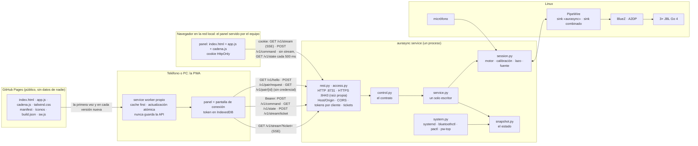

# 10 · El panel de control: qué tiene, cómo se organiza y por qué así

Diseño y medición del 2026-10-01. El panel es la interfaz del servicio de control
(d-7c8794-09d10f, spec del servicio §15). Este documento responde tres preguntas: **qué
tiene** el panel, **cómo se conecta** con el motor, y **qué organización** de sus partes cuesta
menos para las tareas reales, medido y no supuesto (d-7c8794-76b263).

## 1. Cómo se conecta

El mismo panel corre en dos lugares (d-7c8794-37f9bc, 2026-10-02): **servido por el equipo**
(`http://<equipo>:8731`, con la cookie, como siempre; es el respaldo) y como **PWA desde GitHub
Pages** (`https://fabaindaiz.github.io/bluetooth-sync/`), que habla con el equipo por la red local a
`https://<equipo>:8443` con el token de cada cliente. Las dos pasan por un solo transporte
(`host/web/src/transport.ts`); lo único que cambia es la credencial y cómo se abre el stream.



En texto, para la terminal:

```
GitHub Pages ──(archivos, una vez por versión)──► service worker ──► PWA (teléfono)
                                                                       │ HTTPS :8443, Bearer, stream por ticket
navegador en la red local ──(cookie, HTTP :8731)───────────────────────┤
                                                                       ▼
                                      rest.py + access.py ─► control.py ─► service.py
                                                                   │            │
                                                     snapshot.py ◄─┘            ▼
                                                        ▲                  session.py ─► PipeWire ─► BlueZ ─► Go 4
                                          system.py ────┘                       ▲
                                  (systemd, bluetoothctl, pactl, pw-top)        └── micrófono
```

**Primera conexión de un teléfono:** el QR de *Conectar teléfono* abre la PWA con
`#d=<equipo>:8443&fp=<huella de la raíz>` en el fragmento (que Pages nunca recibe); la PWA pregunta
`/v1/hello`, compara la huella, pide acceso y muestra un número de 4 dígitos; un administrador
(o la ventana del primer cliente, o un código de 6 dígitos) lo aprueba, y el token queda en el
teléfono. Si el teléfono no confía en la raíz, el `fetch` falla y la PWA explica cómo instalarla.
Probado en Chromium contra el servicio simulado (`tests_browser/test_pwa.py`); **sin probar en
teléfonos** (research/13 §5).

## 2. Qué tiene (el árbol)

Reorganizado el 2026-10-01 (noche) según lo que pidió el usuario: una pantalla principal con
lo de todos los días, Parlantes en el orden en que se usa, Diagnóstico en tres zonas, y cada
ajuste explicado.

```
Panel
├── Cabecera (fija)
│   ├── marca · SIMULADO · En vivo / Consultando · cambios sin guardar → Guardar · Conectar teléfono
│   ├── Barra de reproducción: Iniciar/Detener · Volumen · Fuente · chip de cortes (→ Cortes) · latencia
│   └── pestañas (en el teléfono, abajo)
├── Avisos (arriba) · «Deshacer» y el toast (abajo, 10 s; §7.1)
├── Escuchar (la principal)
│   ├── Ahora: estado · fuente · entrada · cortes · sincronía
│   │   ├── efectos con su explicación: Ambiente · Separar parlantes · Ecualización · Mantener sincronía
│   │   └── atajos: Calibrar y aplicar (un paso) · Identificar parlantes (un tono en cada uno)
│   ├── Presets: cargar · borrar · guardar el actual
│   ├── Parlantes (compacto): ambiente · volumen · silenciar · tono; con 4 o más, tarjetas plegadas y
│   │   acciones por grupo: Todos / Adelante / Atrás · Silenciar · Activar · Identificar (§7.4)
│   ├── Niveles (20 Hz, sincronizados con lo que suena)
│   ├── A/B ciego: sonoridad de A y de B y su diferencia (aviso sobre 0,5 LU) · «Igualar la sonoridad»
│   └── Entrada: espectro en vivo · correlación L/R · tipo · ancho de banda · formato
├── Cadena (2026-10-02, Preact: se dibuja entera desde la operación `chain`)
│   ├── Calidad: LUFS de entrada y de salida · ganancia de la cadena (LU) · PSR entrada/salida ·
│   │   pico real máximo · % del limitador · avisos «la cadena aplana» y «ganancia perdida» (texto y forma)
│   ├── Entrada → Ambiente → … → Limitador → Parlantes (cada etapa, un salto a su tarjeta)
│   └── una tarjeta por etapa, en el orden de proceso:
│       ├── qué hace (y (?) con el detalle) · latencia que agrega
│       ├── algoritmos: resumen · costo · latencia; los no disponibles, deshabilitados con el motivo
│       ├── perillas del algoritmo elegido (plegadas salvo que alguna esté cambiada): deslizador ·
│       │   número · unidad · ↺ al valor por defecto · (?) · «en vivo» / «con un corte breve» / «al reiniciar»
│       ├── por parlante: una columna por parlante en el PC, un bloque por parlante en el teléfono
│       └── en vivo: las métricas de la etapa (barras de reducción del limitador, etc.)
├── Parlantes (en el orden en que se usa: conectar, ajustar, ubicar)
│   ├── Dispositivos Bluetooth: Buscar cerca · agrupados en conectados, emparejados sin conectar y
│   │   encontrados · batería · señal · Conectar / Desconectar / Agregar / Olvidar
│   ├── Parlantes en detalle: tipo · rol · pan · ambiente · volumen · retardo · tono · silenciar · quitar
│   │   (en el teléfono, con 4 o más, una tarjeta plegada por parlante)
│   └── Sala: una distribución por cada una del servicio · plano con roles y los parlantes sin rol
├── Calibrar
│   ├── Calibración y ecualización: micrófono y su nivel (ventana objetivo) · segundos · amplitud ·
│   │   pasos 1-4 · resultados
│   └── Respuesta en frecuencia (20 Hz-20 kHz, medida y ecualización; tenue donde la coherencia es baja;
│       la leyenda esconde o muestra cada parlante)
├── Diagnóstico (tres zonas)
│   ├── izquierda: Salud (incluye el margen de la salida) y Cortes (línea de tiempo, tabla, causa probable;
│   │   un carril de radio por parlante con descartes/min y bitpool, y «Activar registro de radio»)
│   ├── derecha: Servicios
│   └── abajo, a todo el ancho: Logs
└── Ajustes (cada ajuste con una línea que explica qué hace y (?) con el detalle)
    ├── (Sonido se mudó a Cadena: un enlace lleva allá)
    ├── Sincronía: Recalibración continua · Medir cada · Escuchar durante
    └── Salida (avanzado): Salida · Bloque · Buffer de pw-play · Nombre de la salida · Emisor
```

17 tarjetas (la 17.ª, Cadena), una barra de reproducción y la cabecera. Cada tarjeta es independiente: la
organización solo decide en qué vista va, y una vista puede fijar zonas (Diagnóstico).

**La ayuda de cada ajuste** sigue la guía de "divulgación progresiva": una línea siempre
visible que dice qué hace, en palabras de quien escucha, y el detalle (cómo funciona, qué
cuesta, de dónde sale el valor por defecto) en un globo (?) al costado. El globo se abre
al pasar el mouse, al enfocarlo con el teclado o al tocarlo en el teléfono.

## 3. Las tareas con las que se mide

| Escenario | Frecuencia relativa | Controles, en orden |
|---|---|---|
| Escuchar música | 20 | iniciar · fuente · volumen · cargar un preset · volumen · detener |
| Ajustar el ambiente | 6 | ambiente de Blue · silenciar Red · ver cortes · activar Red · volumen |
| Calibrar y ecualizar | 2 | calibrar · aplicar · ecualizar · ver la respuesta · ver cortes |
| Comparar A/B | 1 | empezar · X · "es A" · X · "es B" · terminar |
| Resolver un problema | 1 | ver cortes (Salud) · servicios · filtrar logs · logs |
| Montar la sala | 0,5 | buscar parlantes · dispositivos · L C R S · pan de Blue · decorrelación (desde el 2026-10-02, en Cadena) |
| Afinar la cadena (desde el 2026-10-02) | 1 | calidad · saltar al limitador · pico real · abrir sus perillas · recuperación · ecualización apagada · ver cortes |

**Costo de un escenario = toques de navegación + pantallas de desplazamiento.** Se arranca en
la primera vista, arriba. Un control en otra vista cuesta 1 toque con pestañas o menú lateral; en
"inicio", 1 desde el inicio o hacia él y 2 entre dos pantallas de detalle. Un control fuera de la
zona visible (descontando las barras fijas) cuesta lo que hay que desplazarse para centrarlo,
en pantallas. **Las posiciones son las del render real** en Chromium, con el servicio simulado:
teléfono 390×844 y PC 1366×900 (`probes/10-panel-organizacion/medir.py`). Lo que el modelo no
cuenta: los toques propios de cada control (iguales en todas) y el esfuerzo de encontrar algo.
En Cadena, un salto a una etapa cuenta como un toque de navegación, y abrir las perillas plegadas
(`<summary>`) como un toque del control.

## 4. Las organizaciones

| | Navegación | Vistas |
|---|---|---|
| **pagina** | ninguna: todo apilado (la del 2026-10-01 a la mañana) | 1 |
| **pestanas** | pestañas arriba en el PC, abajo en el teléfono | Escuchar · Cadena · Parlantes · Calibrar · Diagnóstico · Ajustes |
| **inicio** | un inicio con lo diario y accesos a pantallas de detalle con "volver" | Inicio · Cadena · Sala y parlantes · Calibrar · A/B · Diagnóstico · Ajustes |
| **lateral** | menú lateral en el PC, abajo en el teléfono | Sonido · Cadena · Sala · Medir · Sistema |

## 5. Lo medido. MEDIDO (datos en `experimentos/datos/10/panel-organizaciones.json`)

Total ponderado (menos es mejor), en tres rondas: la primera con las tarjetas tal como venían,
y dos mejoras que salieron de mirar dónde estaba el costo.

| Ronda | Cambio | pagina | pestanas | inicio | lateral |
|---|---|---|---|---|---|
| 1, teléfono | — | 60,0 | 41,2 | 35,3 | 42,1 |
| 2, teléfono | presets antes que parlantes; barra de reproducción compacta (263 → 159 px) | 39,1 | 21,5 | 19,4 | 22,2 |
| **3, teléfono** | tarjeta de parlantes compacta | **34,7** | **18,4** | **17,0** | **19,1** |
| 1, PC | — | 14,3 | 6,6 | 8,2 | 7,2 |
| **3, PC** | (las mismas mejoras) | **13,2** | **6,5** | **8,1** | **7,1** |

Detalle de la ronda 3 (toques + pantallas):

| Escenario | Teléfono: pagina · pestanas · inicio · lateral | PC: pagina · pestanas · inicio · lateral |
|---|---|---|
| Escuchar música (×20) | 0 · 0 · 0 · 0 | 0 · 0 · 0 · 0 |
| Ajustar el ambiente (×6) | 1,1 · 1,2 · 1,1 · 1,2 | 0 · 0 · 0 · 0 |
| Calibrar y ecualizar (×2) | 6,7 · 1,0 · 1,0 · 1,0 | 3,1 · 1,0 · 1,0 · 1,0 |
| Comparar A/B (×1) | 1,6 · 1,8 · 1,0 · 1,8 | 0 · 0 · 1,0 · 0 |
| Resolver un problema (×1) | 7,4 · 4,0 · 3,9 · 3,9 | 3,7 · 2,4 · 2,4 · 2,5 |
| Montar la sala (×0,5) | 11,6 · 6,5 · 7,5 · 8,3 | 6,5 · 4,2 · 5,3 · 5,2 |

**Lo que dicen los números:**
- la **página única** (la de antes) es la peor siempre: el doble que las demás;
- las dos mejoras de la ronda 2 pesaron más que la organización misma: en el teléfono bajaron
  todas un ~45 %. Lo que más se hace (escuchar música) quedó en 0 en todas;
- **pestanas** es la mejor en el PC (6,5) y queda a un 8 % de **inicio** en el teléfono (18,4
  contra 17,0). La ventaja de "inicio" sale casi entera del A/B en pantalla propia; sin ese
  escenario quedan a 0,6.

### 5.1 Después de los arreglos de usabilidad (paquete D) y de la pantalla Cadena (paquete F). MEDIDO

Mac, Chromium headless, servicio simulado (2026-10-02). `pestanas`, total ponderado:

| Versión | Escenarios | Teléfono | PC |
|---|---|---|---|
| ronda 3 (2026-10-01) | seis | 18,4 | 6,5 |
| `f44efb2` (la tarjeta Ahora empujó la compacta y el A/B hacia abajo) | seis | 28,0 | 10,2 |
| paquete D (entre otros, `.inline` → `.hstack`) | seis | 24,6 | 9,9 |
| **paquete F (Cadena)** | seis | **26,1** | **10,0** |
| **paquete F (Cadena)** | siete (con «Afinar la cadena») | **31,4** | **13,7** |

De dónde salen los +1,5 del teléfono (medido escondiendo cada parte): +1,0 la decorrelación, que
pasó de Ajustes a la segunda tarjeta de Cadena («Montar la sala», ×0,5); +0,3 el recuadro de radio
en Cortes (empuja Servicios y Logs; sin registro ni datos ya no muestra los carriles); +0,2 la
casilla «Igualar la sonoridad» del A/B. La pestaña nueva no cuesta nada por sí misma (escondida, el
total no cambia).

**En Linux mide más (MEDIDO, 2026-10-04, `PC-Ryzen5`, Chromium headless):** el mismo código de `main`
(489fc8a) da **32,0** y **13,6** (seis: 26,7 y 10,0) contra 31,4 y 13,7 del Mac; la diferencia es del
render (las fuentes), no del panel, y la guardia fallaba por eso. Ahora la guardia lleva un límite
por plataforma. La etapa «Modo espacial» de Cadena (spec 2026-10-04) suma **+0,4** en los dos («Montar
la sala» pasa por encima de ella hasta la decorrelación); sus textos se acortaron a una línea para
dejarla en eso (era +0,5). Con el monitor de audífonos, al final de Escuchar, el total no cambia.

Las cuatro organizaciones con los siete escenarios (datos en
`experimentos/datos/10/panel-organizaciones-cadena-2026-10-02.json`):

| | pagina | pestanas | inicio | lateral |
|---|---|---|---|---|
| teléfono, siete (seis) | 94,2 (88,4) | 31,4 (26,1) | **27,5 (22,4)** | 30,3 (25,0) |
| PC, siete (seis) | 37,9 (34,9) | 13,7 (10,0) | 11,3 (7,9) | **10,8 (7,3)** |

**Lo nuevo que dicen:** en el PC, `pestanas` ya no es la mejor: su fila de pestañas suma 52 px a la
cabecera fija (153 px contra 101 de las otras) y eso cuesta desplazamiento en cada escenario. La
decisión de usarla por defecto (abajo) se tomó con la ronda 3; reabrirla es del usuario.

**Las perillas plegadas y los saltos.** Con todas las perillas abiertas, Cadena medía ~7 800 px en el
teléfono y «Afinar la cadena» costaba 16,9 (el limitador es la 8.ª etapa); plegándolas (abiertas
desde el principio si alguna está cambiada) bajó a 12,1, y con un salto a cada etapa desde la fila
«Entrada → … → Parlantes», a 5,3.

**Costo de dibujo** (`render_cost.py`, 390×844, DPR 3, datos en
`experimentos/datos/10/render-cost-2026-10-02.json`). El paquete D bajó Niveles, con freno ×4, de 421
a 17 layouts/s y de 326 a 97 ms/s de hilo principal. Con Cadena (paquete F): Niveles sigue en
16,6 layouts/s; su hilo principal midió 173-201 ms/s, **igual con y sin `cadena.js`** (201 contra
211, intercalados, con el Mac cargado: carga 13-17 contra 7-9 en la medición de D): la diferencia
con los 97 es la carga, no la pantalla nueva, que oculta no se dibuja (un test lo comprueba). La
propia Cadena a la vista, sonando (métricas a 5 Hz, calidad a 2 Hz): 3 layouts/s y 114 ms/s con
freno ×4 (2,2 y 33 sin freno), dentro del criterio (≤ 65 y ≤ 150).

**Decisión: pestanas por defecto** (d-7c8794-76b263). Es la mejor en el PC, casi empatada en el
teléfono, el mismo modelo en los dos, y nunca cuesta más de un toque cambiar de sección (en
"inicio", ir de un detalle a otro cuesta dos). Las otras tres siguen disponibles con
`?layout=pagina|inicio|lateral`, y la elección queda recordada en el navegador.

## 6. Cómo se construye

- **Tailwind v4.3.3, compilado y versionado.** `hatch run web:css` usa el CLI oficial (por
  `pytailwindcss`, sin Node) y escribe `panel/tailwind.css` (~40 KB). El servicio no depende de
  nada en tiempo de ejecución ni de internet: el teléfono abre el panel en la red local. **No** se
  usa el CDN de Tailwind: no funciona sin internet y su autor lo desaconseja para producción.
- Los componentes repetidos (`.card`, `.btn`, `.chip`, `.tile`, tablas, gráficos) están en
  `panel/tailwind.input.css` con `@apply`, porque `app.js` crea elementos con esas clases.
- **Modo oscuro** según el sistema.
- `window.aurasyncShow(selector)` muestra la vista que contiene un elemento: lo usan los tests y
  la medición.
- **La aplicación web en Vite + TypeScript + Preact** (d-7c8794-6da524, desde el 2026-10-02), solo
  para lo que se migra; hoy, la pantalla Cadena. Las fuentes están en `host/web/` (npm directo, con
  el Node del sistema; versiones exactas y `package-lock.json`):
  - `src/main.tsx` monta Cadena en `#chain-root`; `src/bridge.ts` recibe de `app.js` el estado y los
    eventos del stream (`aurasync:state`, `:quality`, `:chain`, `:radio`: `app.js` tiene el único
    `EventSource`) y manda las órdenes como él; `src/chain/*.tsx` son la pantalla; `src/format.ts` y
    `src/sender.ts`, la lógica pura (números en español, la franja de calidad, el ritmo de 80 ms).
  - `src/contract.gen.ts` **lo genera Python** (`hatch run gen-types`, desde
    `host/src/aurasync/contract_types.py`): las operaciones que manda la aplicación y sus
    argumentos salen de `control.OPS`, los conjuntos cerrados de los descriptores de `chain.py`, y
    las formas de las respuestas y los eventos, de `TypedDict`s que `tests/test_contract_types.py`
    contrasta con lo que el servicio simulado manda de verdad. Nada de una etapa en particular
    entra en ese archivo: una etapa nueva en Python aparece sin recompilar.
  - `npm run build` escribe `panel/cadena.js` (32 KB, 12 KB comprimido) y su sello
    `panel/cadena.build.json` (hash de las fuentes y de lo escrito); el build es determinista.
    `scripts/check.sh` lo comprueba **sin Node** con `host/scripts/web_stamp.py`.
    `npm run check` es `tsc` estricto; `npm test`, vitest con la lógica pura.
  - Las clases de Tailwind de `host/web/src` entran al mismo `tailwind.css` (`@source`).
- **Tests:** 81 de navegador en Chromium (2026-10-02, con `test_panel_usability.py`; antes 65) (Firefox no arranca en el Mac), entre ellos uno que recorre
  las 14 tarjetas en las cuatro organizaciones, uno del ir y volver de "inicio", y los de Cadena
  (`tests_browser/test_panel_chain.py`: se dibuja entera desde `chain`; algoritmo, perilla y ↺
  llegan al servicio; una etapa agregada en Python aparece sola; la franja de calidad y sus
  avisos; el A/B con la sonoridad; la radio en Cortes; el teléfono).

## 7. Los pendientes de usabilidad (2026-10-02)

Del informe de usabilidad (research/11 §4; recomendaciones 5, 10 y 11) y de experimentos/16 §7. Mac,
Chromium headless, servicio simulado. Cada cambio tiene su test de navegador
(`tests_browser/test_panel_usability.py`) y se lo vio fallar con una mutación del cambio.

### 7.1 Deshacer en vez de `confirm()`

"Never use a warning when you mean undo" (Raskin, VERIFICADO en research/11 §4.3). El panel ya no
abre ningún diálogo: `tests_browser/conftest.py` registra los diálogos de todos los contextos y cada
test falla si apareció uno. Hay dos clases de acción (`host/web/src/undo.ts`):

| Acción | Se hace | «Deshacer» (10 s) |
|---|---|---|
| Cargar un preset · quitar un parlante · aplicar una calibración (los dos botones) | al instante | vuelve a escribir el estado artístico de antes: los campos de cada parlante (`pan`, `ambience`, `gain_db`, `delay_ms`, `muted`, `kind`, `eq_db`), los globales (`rear_delay_ms`, `extract_ambience`, `decorrelate`, `eq_active`) y las elecciones de la cadena salvo el volumen; un parlante quitado se vuelve a agregar primero. Si el lazo corre, se apaga y se enciende alrededor de los retardos (como `calibration_apply`) |
| Olvidar un dispositivo · borrar un preset | se muestra hecho; la orden sale al vencer el aviso (o al irse de la página) | la cancela |
| Quitar la ecualización | al instante: las curvas se borran y la ecualización queda encendida y plana | vuelve a escribir las curvas (`eq_db`) |

**Lo que no vuelve (INFERIDO, por el contrato):** un parlante vuelto a agregar queda al final de la
lista. Un preset borrado no se puede volver a escribir desde el panel: por eso espera.

**Desde el 2026-10-04 `set` escribe `eq_db`** (una elevación por tercio, de 0 a 6 dB, o `null`;
`control.SPEAKER_FIELDS`): quitar la ecualización pasó a ser de la primera clase —se hace al instante y
«Deshacer» vuelve a escribir las curvas— y un parlante vuelto a agregar recupera su curva
(`test_clearing_the_eq_is_done_at_once_and_undo_writes_the_curves_back`, `web/test/undo.test.ts`).

### 7.2 El nivel del micrófono antes de calibrar

Como Dirac Live (research/11 §4.2): en el paso 1, una pista de −80 a 0 dBFS con la **ventana
objetivo marcada**, el número y el estado en palabras y con una forma: «en la ventana», «demasiado
bajo», «demasiado alto», «saturado», «sin música: no se puede comprobar», «sin lectura». Fuera de la
ventana, «Calibrar» (y «Calibrar y aplicar» en Escuchar) **avisa y pide confirmar** («Calibrar
igual» / «Cancelar») en vez de arrancar.

- **De dónde sale:** el mismo nivel que Niveles muestra como «Micrófono» (`meters.mic`, por el
  stream o en el estado). Lo mide el lazo: con el lazo apagado no hay lectura, y el panel lo dice.
- **La ventana es ORIENTATIVA (INFERIDO, sin medir con el fifine):** RMS de −55 a −10 dBFS y pico
  bajo −1 dBFS. «Demasiado bajo» solo se dice si algo suena (la entrada pasa de −45 dBFS): en
  silencio, el micrófono oye su piso (−60 dBFS en la sala simulada) y eso no es un error. La
  ventana se ajusta cuando haya calibraciones reales con su nivel anotado.
- **Lo que no mide:** el nivel de la música de ahora, no el del ruido de calibración (amplitud 0,1).
  Sirve para saber si el micrófono oye los parlantes y si satura, no para fijar la amplitud.

### 7.3 Coherencia en la respuesta en frecuencia

La calibración trae `results[].coherence` (γ² por tercio, alineada con `response_hz`; la agregó el
2026-10-02 otro paquete, `dsp/response.py`). Cada tercio se dibuja como un tramo propio, y uno con
**γ² < 0,5 va tenue** (clase `low-coherence`, opacidad 0,25), como el *blanking* de Smaart. El
umbral es **orientativo**: γ² = 0,5 es la mitad de la energía del micrófono explicada por lo que se
mandó. Sin el campo, la curva es una sola línea, como antes. Con 8 curvas no se lee ninguna
(experimentos/16 §7): cada parlante de la leyenda es un botón que esconde o muestra la suya.

### 7.4 Ocho parlantes. MEDIDO (render real, servicio SIMULADO)

Desde **4 parlantes** (con 3 todo se ve como antes):

- **Escuchar → Parlantes:** una tarjeta plegada por parlante (nombre corto y estado, Tono y
  Silenciar a la vista; ambiente y volumen al abrirla con ▸), y **acciones por grupo**: Todos /
  Adelante / Atrás · Silenciar · Activar · Identificar (un tono en cada uno, de a uno). Adelante y
  atrás salen del ángulo del rol (`role_places`, menos de 90° es adelante; los laterales van atrás),
  o de su lugar fijo, o sin rol del ambiente (0,35 o más es atrás): **INFERIDO** mientras el
  servicio no traiga la posición de cada parlante.
- **Parlantes en detalle**, en el teléfono: una tarjeta plegada por parlante en vez de la tabla de 9
  columnas. En el PC, la tabla.
- **Cadena**, en el teléfono: el bloque de cada parlante plegado; tocando el nombre se abre, y dice
  «cambiado» si alguna perilla propia de la cadena no está en su valor por defecto. En el PC, una
  columna por parlante (con 8, cada una ≥ 90 px).
- **Sala:** los botones de distribución salen de las del servicio (`roles`; con más de tres, en una
  grilla); cada rol va donde lo pone su ángulo (`role_places`, campo nuevo del estado en
  `snapshot.py`), y los parlantes sin rol se dibujan donde los ponen su pan y su ambiente (antes
  eran una línea de texto al pie).
- **Niveles** (11 barras) y **Cortes** (8 carriles de radio con el nombre) no cambiaron: entran.
- Dos colores más (`--s7`, `--s8`) para las curvas; el nombre va siempre al lado.

**Arreglos que salieron de medir con 8:** la ruta del archivo de cambios de la radio (una palabra
larga) ensanchaba la página del teléfono 63 px; y la fila de seis pestañas de abajo dejaba
«Ajustes» 18 px afuera (pasa con cualquier N).

Con `medir.py --ocho` (`pestanas`, datos en `experimentos/datos/10/panel-ocho-parlantes.json`):

| | teléfono 3 · 8 | PC 3 · 8 |
|---|---|---|
| total, siete escenarios | 31,4 · **41,5** | 13,7 · **15,9** |
| total, seis | 26,1 · 36,3 | 10,0 · 12,2 |
| alto de Escuchar (px) | 1934 · 2286 | 1076 · 1436 |
| alto de Parlantes (px) | 1913 · 2694 | 1289 · 1979 |
| alto de Cadena (px) | 4988 · 4998 | 2674 · 2664 |
| alto de Diagnóstico (px) | 3032 · 3072 | 1761 · 1781 |

Con 3 parlantes los totales no cambiaron (31,4 y 13,7, el tope del test de regresión). Con 8, lo que
más sube en el teléfono es el A/B y la entrada (debajo de 8 tarjetas y 11 medidores: 4,2 → 5,6) y
«Montar la sala» (5,8 → 8,3, 8 tarjetas de dispositivos). Parte del costo es el aviso «la
calibración se midió con la decorrelación encendida», que aparece porque con 7 u 8 la decorrelación
se apaga para que la sesión arranque (experimentos/16 §2). Nada se desborda en ninguna vista, en
390×844 ni en 1366×900 (test `test_eight_speakers_fit_every_screen`). **Sin probar en un teléfono
real.**


## 8. Pruebas de usabilidad por flujos (2026-10-04, `PC-Ryzen5`)

**Pedido (usuario):** "pruebas de usabilidad en la plataforma basadas en flujos y acciones que un
usuario haría, evalúes cómo resultan y posibles mejoras para aplicar. La idea es facilitar el uso de
la herramienta para el usuario final."

**Método (SIMULADO: Chromium headless, servicio simulado, 3 Go 4, sin parlantes).** Dos pasos, en
`probes/18-usabilidad/`: `capturas.py` saca cada pestaña entera en el teléfono (390×844) y en el PC
(1366×900), para mirarlas como alguien que llega por primera vez; `flujos.py` hace ocho tareas como
las haría una persona —con clics de verdad, en orden, desde Escuchar arriba y con la sesión
detenida— y cuenta toques, cambios de pestaña, pantallas de desplazamiento (lo que hubo que bajar
para ver el control antes de tocarlo) y lo que trabó. Complementa la medida de §5 (que compara
organizaciones con un modelo de costo): esta mira si la tarea **se puede hacer y se entiende**.

**Resultados en el teléfono (MEDIDO, antes → después de los arreglos de abajo):**

| Flujo | Toques | Pestañas | Pantallas | Lo que se encontró |
|---|---|---|---|---|
| Poner música | 3 → 3 | 0 → 0 | 0 → 0 | — |
| Probar el modo espacial | 2 → 2 | **1 → 0** | **2,07 → 0** | el modo no estaba en Escuchar: había que saber que vive en Parlantes → Espacial |
| Un parlante no suena | 3 → 3 | 0 → 0 | 0,90 → 0,90 | **los tres nombres se cortaban en «JBL Go 4…»**: no se sabía cuál era cuál |
| Calibrar | 2 → 2 | 0 → 0 | 0 → 0 | — |
| Guardar un preset | 3 → 3 | 0 → 0 | 0,41 → 0,42 | — |
| Audífonos | 3 → 3 | 0 → 0 | 2,46 → 2,51 | la tarjeta está al final de Escuchar (queda propuesto) |
| Sumar un parlante | 2 → 2 | 1 → 1 | 0 → 0,49 | **la tabla de dispositivos se cortaba: «Emparejar y conectar» quedaba fuera de la pantalla** |
| Ubicar los parlantes | 1 → 1 | 1 → 1 | 1,42 → 2,21 | con 3 parlantes la sala de fábrica (cuadrafonía) deja uno «sin rol», sin decir qué hacer |

En el PC los ocho flujos terminan, sin trabas, con a lo sumo 1,05 pantallas. Las pantallas que
subieron en «Sumar un parlante» y «Ubicar los parlantes» son el costo de lo que se arregló: la tabla
ahora es una tarjeta por dispositivo (más alta, pero con los botones a la vista) y el aviso de la
sala es texto nuevo.

**Lo que se aplicó (cada uno con su test en `tests_browser/test_panel_flows.py`):**

1. **El modo en la barra de reproducción** («Modo: clásico · espacial · frente intacto», junto a la
   fuente): a la vista en todas las pestañas, sin empujar ninguna tarjeta. Primero se probó en la
   tarjeta Ahora y la guardia de §5 lo atajó: empujaba Presets y «Escuchar música» (peso 20) pasaba a
   costar 0,54 pantallas, el total subía a 45,1.
2. **Los nombres enteros en el teléfono:** el nombre corto («Go 4 Red · FL») y el estado debajo, como
   ya se hacía desde 4 parlantes; el completo queda en el título.
3. **Dispositivos Bluetooth como tarjetas en el teléfono**, con los botones en su propia fila.
4. **La sala dice cuando un parlante quedó sin lugar** y ofrece «Usar «Automático»» en un toque.
5. **El A/B dice por qué no se puede empezar** («Hacen falta dos presets para comparar…»), en vez de
   un botón gris.
6. **«Medir desde aquí» enciende la sonda** si estaba apagada (y lo dice), en vez de mandar a Ajustes.

7. **El aviso del micrófono no se salta en un hueco de lectura:** al terminar una calibración el lazo
   vuelve a empezar y por unos segundos no hay lectura; en ese hueco «Calibrar y aplicar» calibraba sin
   avisar aunque el micrófono acabara de estar demasiado bajo. El último aviso vale 15 s. Lo encontró el
   test inestable de 2026-10-02, una vez instrumentado (`test_a_gap_in_the_reading_does_not_skip_the_warning`,
   visto fallar sin el arreglo).

La guardia de §5 sube +0,3 en el teléfono por los dos textos nuevos (4 y 5), anotado en el test.

**Propuestas que quedan (no aplicadas; cambian la organización o sacan información):**

- **Escuchar es larga en el teléfono** (2.900 px): «Entrada» (correlación L/R, ancho de banda, las
  aplicaciones) es diagnóstico y empuja al monitor de audífonos al final (2,5 pantallas). Pasarla a
  Diagnóstico, o plegarla, dejaría Escuchar en lo de todos los días.
- **«Parlantes en detalle» muestra la MAC, el códec y el `modalias`** en cada fila: para el usuario
  final es ruido, y empuja la sala más abajo (2,2 pantallas para ubicarlos). Llevarlo a un «ver
  detalles» por parlante.
- **La cabecera muestra «Latencia ≥ 399 ms»**, un número técnico que a quien escucha no le dice qué
  hacer; podría ir a Diagnóstico o al título de la sincronía.
- **El A/B pide dos presets guardados**: un «comparar con como está ahora» ahorraría el paso más
  largo del flujo.
- **Para una instalación de 3 parlantes la sala de fábrica debería ser «Automático»**, no
  cuadrafonía (hoy el aviso lo resuelve en un toque, pero el primer contacto ya tiene un error).

**Sin probar:** con personas (esto es una persona simulada, que sabe qué buscar) y en un teléfono real.
