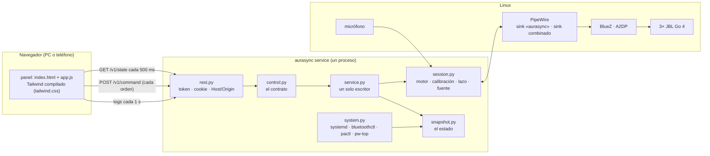

# 10 · El panel de control: qué tiene, cómo se organiza y por qué así

Diseño y medición del 2026-10-01. El panel es la interfaz del servicio de control
(d-7c8794-09d10f, spec del servicio §15). Este documento responde tres preguntas: **qué
tiene** el panel, **cómo se conecta** con el motor, y **qué organización** de sus partes cuesta
menos para las tareas reales, medido y no supuesto (d-7c8794-76b263).

## 1. Cómo se conecta



En texto, para la terminal:

```
navegador ──(estado c/500 ms, órdenes, logs c/1 s)──► rest.py ─► control.py ─► service.py
                                                                   │            │
                                                     snapshot.py ◄─┘            ▼
                                                        ▲                  session.py ─► PipeWire ─► BlueZ ─► Go 4
                                          system.py ────┘                       ▲
                                  (systemd, bluetoothctl, pactl, pw-top)        └── micrófono
```

## 2. Qué tiene (el árbol)

Reorganizado el 2026-10-01 (noche) según lo que pidió el usuario: una pantalla principal con
lo de todos los días, Parlantes en el orden en que se usa, Diagnóstico en tres zonas, y cada
ajuste explicado.

```
Panel
├── Cabecera (fija)
│   ├── marca · SIMULADO · En vivo / Consultando · cambios sin guardar → Guardar · Conectar teléfono
│   ├── Barra de reproducción: Iniciar/Detener · Volumen · Fuente · chip de cortes (→ Cortes) · latencia
│   └── pestañas (en el teléfono, abajo)
├── Avisos
├── Escuchar (la principal)
│   ├── Ahora: estado · fuente · entrada · cortes · sincronía
│   │   ├── efectos con su explicación: Ambiente · Separar parlantes · Ecualización · Mantener sincronía
│   │   └── atajos: Calibrar y aplicar (un paso) · Identificar parlantes (un tono en cada uno)
│   ├── Presets: cargar · borrar · guardar el actual
│   ├── Parlantes (compacto): ambiente · volumen · silenciar · tono
│   ├── Niveles (20 Hz, sincronizados con lo que suena)
│   ├── A/B ciego
│   └── Entrada: espectro en vivo · correlación L/R · tipo · ancho de banda · formato
├── Parlantes (en el orden en que se usa: conectar, ajustar, ubicar)
│   ├── Dispositivos Bluetooth: Buscar cerca · agrupados en conectados, emparejados sin conectar y
│   │   encontrados · batería · señal · Conectar / Desconectar / Agregar / Olvidar
│   ├── Parlantes en detalle: tipo · rol · pan · ambiente · volumen · retardo · tono · silenciar · quitar
│   └── Sala: cuadrafonía / L C R S · plano con roles
├── Calibrar
│   ├── Calibración y ecualización: micrófono · segundos · amplitud · pasos 1-4 · resultados
│   └── Respuesta en frecuencia (20 Hz-20 kHz, medida y ecualización)
├── Diagnóstico (tres zonas)
│   ├── izquierda: Salud (incluye el margen de la salida) y Cortes (línea de tiempo, tabla, causa probable)
│   ├── derecha: Servicios
│   └── abajo, a todo el ancho: Logs
└── Ajustes (cada ajuste con una línea que explica qué hace y (?) con el detalle)
    ├── Sonido: Ambiente · Decorrelación · Ecualización · Retardo trasero
    ├── Sincronía: Recalibración continua · Medir cada · Escuchar durante
    └── Salida (avanzado): Salida · Bloque · Buffer de pw-play · Nombre de la salida · Emisor
```

16 tarjetas, una barra de reproducción y la cabecera. Cada tarjeta es independiente: la
organización solo decide en qué vista va, y una vista puede fijar zonas (Diagnóstico).

**La ayuda de cada ajuste** sigue la guía de "divulgación progresiva": una línea siempre
visible que dice qué hace, en palabras de quien escucha, y el detalle (cómo funciona, qué
cuesta, de dónde sale el valor por defecto) en un globo (?) al costado. El globo se abre
al pasar el mouse, al enfocarlo con el teclado o al tocarlo en el teléfono.

## 3. Las tareas con las que se mide

| Escenario | Frecuencia relativa | Controles, en orden |
|---|---|---|
| Escuchar música | 20 | iniciar · fuente · volumen · cargar un preset · volumen · detener |
| Ajustar el ambiente | 6 | ambiente de Blue · silenciar Red · ver cortes · activar Red · volumen |
| Calibrar y ecualizar | 2 | calibrar · aplicar · ecualizar · ver la respuesta · ver cortes |
| Comparar A/B | 1 | empezar · X · "es A" · X · "es B" · terminar |
| Resolver un problema | 1 | ver cortes (Salud) · servicios · filtrar logs · logs |
| Montar la sala | 0,5 | buscar parlantes · dispositivos · L C R S · pan de Blue · decorrelación |

**Costo de un escenario = toques de navegación + pantallas de desplazamiento.** Se arranca en
la primera vista, arriba. Un control en otra vista cuesta 1 toque con pestañas o menú lateral; en
"inicio", 1 desde el inicio o hacia él y 2 entre dos pantallas de detalle. Un control fuera de la
zona visible (descontando las barras fijas) cuesta lo que hay que desplazarse para centrarlo,
en pantallas. **Las posiciones son las del render real** en Chromium, con el servicio simulado:
teléfono 390×844 y PC 1366×900 (`probes/10-panel-organizacion/medir.py`). Lo que el modelo no
cuenta: los toques propios de cada control (iguales en todas) y el esfuerzo de encontrar algo.

## 4. Las organizaciones

| | Navegación | Vistas |
|---|---|---|
| **pagina** | ninguna: todo apilado (la del 2026-10-01 a la mañana) | 1 |
| **pestanas** | pestañas arriba en el PC, abajo en el teléfono | Escuchar · Parlantes · Calibrar · Diagnóstico · Ajustes |
| **inicio** | un inicio con lo diario y accesos a pantallas de detalle con "volver" | Inicio · Sala y parlantes · Calibrar · A/B · Diagnóstico · Ajustes |
| **lateral** | menú lateral en el PC, abajo en el teléfono | Sonido · Sala · Medir · Sistema |

## 5. Lo medido. MEDIDO (datos en `experimentos/datos/10/panel-organizaciones.json`)

Total ponderado (menos es mejor), en tres rondas: la primera con las tarjetas tal como venían,
y dos mejoras que salieron de mirar dónde estaba el costo.

| Ronda | Cambio | pagina | pestanas | inicio | lateral |
|---|---|---|---|---|---|
| 1, teléfono | — | 60,0 | 41,2 | 35,3 | 42,1 |
| 2, teléfono | presets antes que parlantes; barra de reproducción compacta (263 → 159 px) | 39,1 | 21,5 | 19,4 | 22,2 |
| **3, teléfono** | tarjeta de parlantes compacta | **34,7** | **18,4** | **17,0** | **19,1** |
| 1, PC | — | 14,3 | 6,6 | 8,2 | 7,2 |
| **3, PC** | (las mismas mejoras) | **13,2** | **6,5** | **8,1** | **7,1** |

Detalle de la ronda 3 (toques + pantallas):

| Escenario | Teléfono: pagina · pestanas · inicio · lateral | PC: pagina · pestanas · inicio · lateral |
|---|---|---|
| Escuchar música (×20) | 0 · 0 · 0 · 0 | 0 · 0 · 0 · 0 |
| Ajustar el ambiente (×6) | 1,1 · 1,2 · 1,1 · 1,2 | 0 · 0 · 0 · 0 |
| Calibrar y ecualizar (×2) | 6,7 · 1,0 · 1,0 · 1,0 | 3,1 · 1,0 · 1,0 · 1,0 |
| Comparar A/B (×1) | 1,6 · 1,8 · 1,0 · 1,8 | 0 · 0 · 1,0 · 0 |
| Resolver un problema (×1) | 7,4 · 4,0 · 3,9 · 3,9 | 3,7 · 2,4 · 2,4 · 2,5 |
| Montar la sala (×0,5) | 11,6 · 6,5 · 7,5 · 8,3 | 6,5 · 4,2 · 5,3 · 5,2 |

**Lo que dicen los números:**
- la **página única** (la de antes) es la peor siempre: el doble que las demás;
- las dos mejoras de la ronda 2 pesaron más que la organización misma: en el teléfono bajaron
  todas un ~45 %. Lo que más se hace (escuchar música) quedó en 0 en todas;
- **pestanas** es la mejor en el PC (6,5) y queda a un 8 % de **inicio** en el teléfono (18,4
  contra 17,0). La ventaja de "inicio" sale casi entera del A/B en pantalla propia; sin ese
  escenario quedan a 0,6.

**Decisión: pestanas por defecto** (d-7c8794-76b263). Es la mejor en el PC, casi empatada en el
teléfono, el mismo modelo en los dos, y nunca cuesta más de un toque cambiar de sección (en
"inicio", ir de un detalle a otro cuesta dos). Las otras tres siguen disponibles con
`?layout=pagina|inicio|lateral`, y la elección queda recordada en el navegador.

## 6. Cómo se construye

- **Tailwind v4.3.3, compilado y versionado.** `hatch run web:css` usa el CLI oficial (por
  `pytailwindcss`, sin Node) y escribe `panel/tailwind.css` (~40 KB). El servicio no depende de
  nada en tiempo de ejecución ni de internet: el teléfono abre el panel en la red local. **No** se
  usa el CDN de Tailwind: no funciona sin internet y su autor lo desaconseja para producción.
- Los componentes repetidos (`.card`, `.btn`, `.chip`, `.tile`, tablas, gráficos) están en
  `panel/tailwind.input.css` con `@apply`, porque `app.js` crea elementos con esas clases.
- **Modo oscuro** según el sistema.
- `window.aurasyncShow(selector)` muestra la vista que contiene un elemento: lo usan los tests y
  la medición.
- **Tests:** 50 de navegador (25 casos en Chromium y en Firefox), entre ellos uno que recorre las
  13 tarjetas en las cuatro organizaciones y uno del ir y volver de "inicio".
